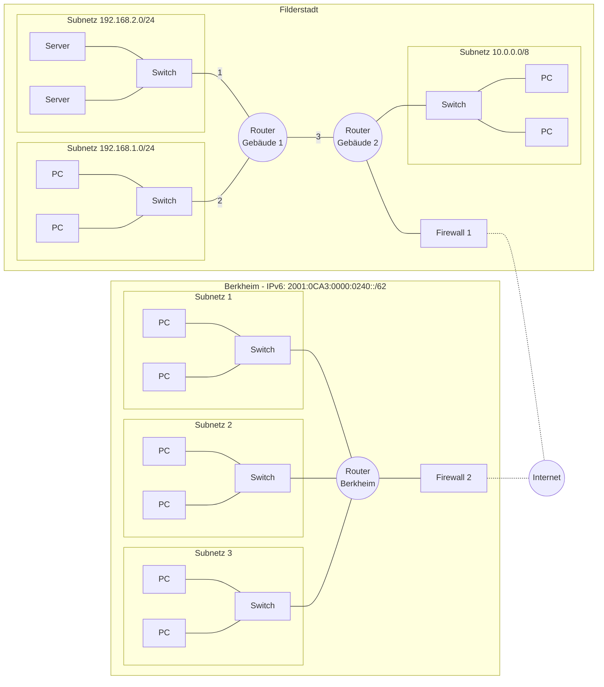
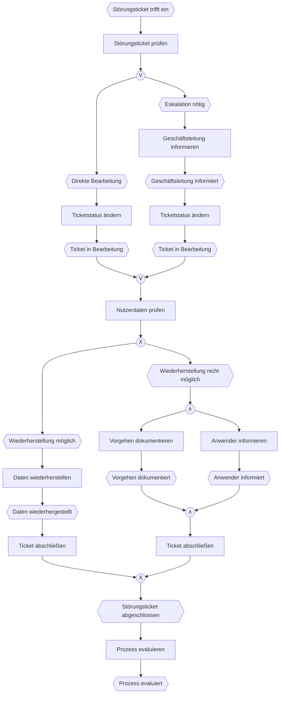
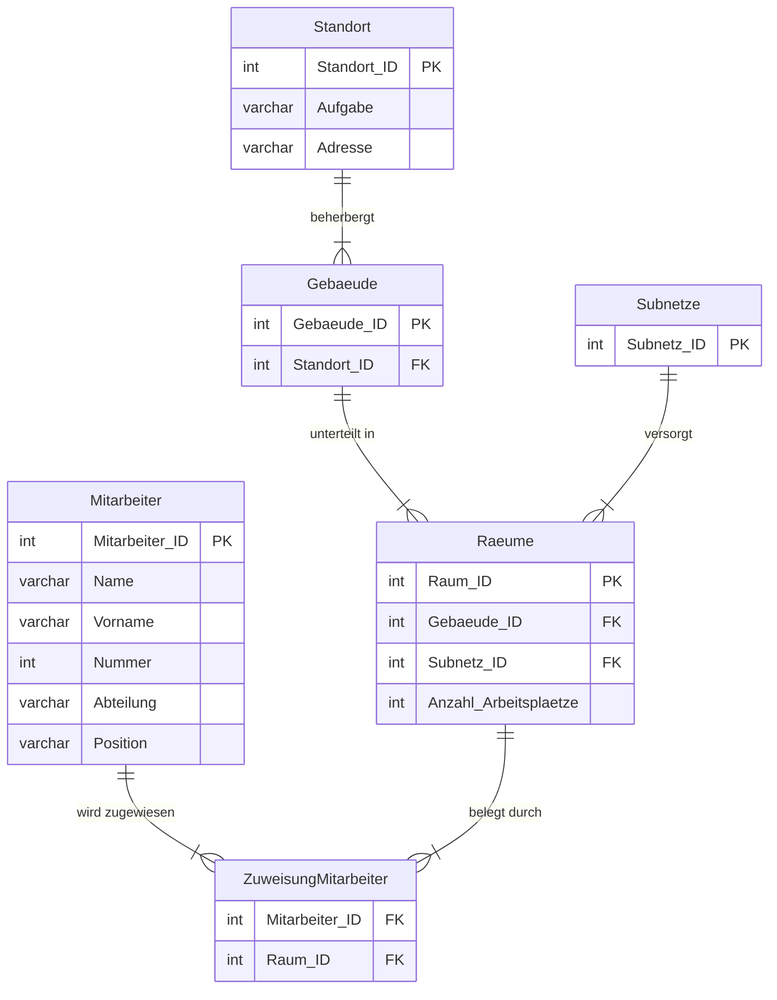
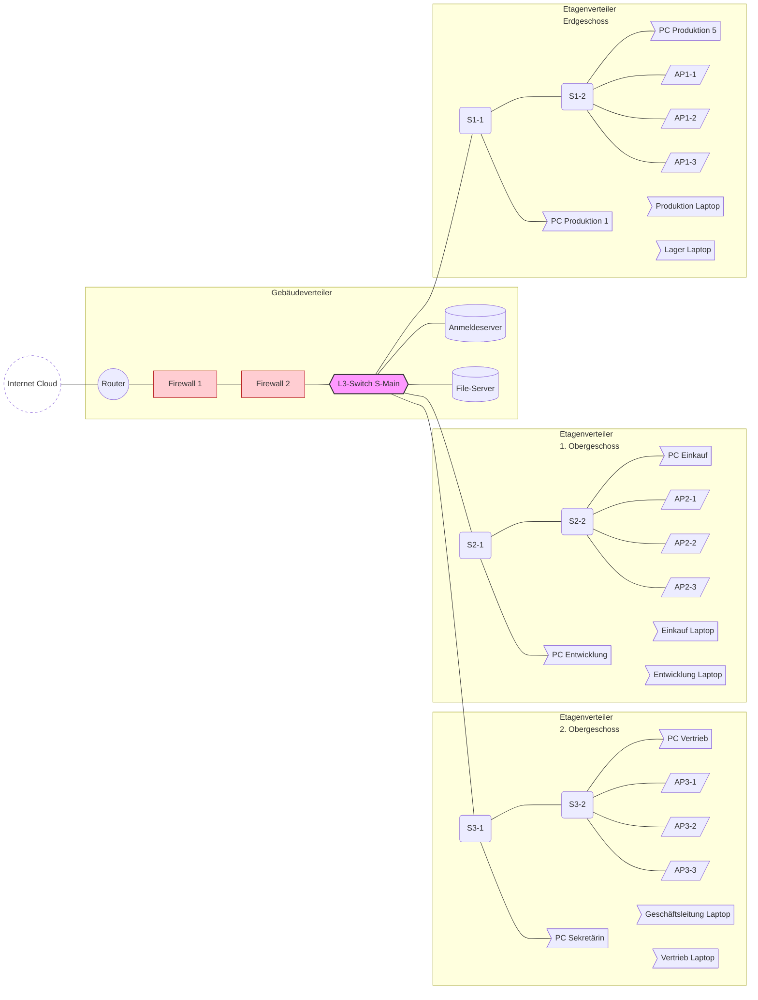
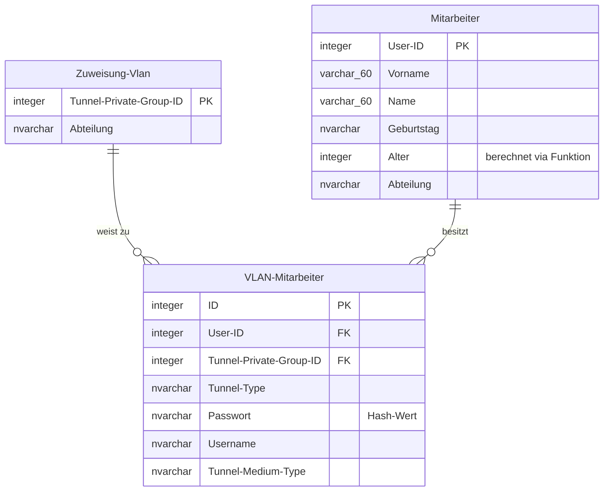

# Sommer 2022 - Analyse und Entwicklung von Netzwerken
## Anlagen
### Anlage 1 - Netzwerkinfrastruktur zu Aufgabe 1


| **Schnittstelle** | **IP-Adresse an der Router Schnittstelle** |
| ----------------- | ------------------------------------------ |
| **1**             |                                            |
| **2**             |                                            |
| **3**             |                                            |

### Anlage 2 - Routingtabelle Router Gebäude 1 zu Aufgabe 1
| Netzwerkadresse | Subnetzmaske nach CIDR | Subnetzmaske nach dotted-decimal | Gateway Adresse | Schnittstelle |
| --------------- | ---------------------- | -------------------------------- | --------------- | ------------- |
| 0.0.0.0         | /0                     | 0.0.0.0                          | 192.168.0.1     | 192.168.0.2   |
| 127.0.0.0       |                        |                                  |                 | 127.0.0.1     |
| 192.168.1.0      |                        |                                  |                 | 192.168.1.1   |
| 192.168.2.0     |                        |                                  |                 | 192.168.2.1   |
| 10.0.0.0        |                        |                                  |                 | 192.168.0.2   |

### Anlage 3 - EPK zu Aufgabe 3


## Aufgabe 1 - Netzwerkkonfiguration am Standort Filderstadt (50 Punkte)
Die neue Niederlassung in Berkheim soll aus Gründen der Zukunftssicherheit ausschließlich das Internet Protokoll in der Version 6 verwenden. Der bestehende Standort behält vorerst die bestehende IPv4 Adressstruktur.

### Aufgabe 1.1 (4,5 Punkte)
#### Aufgabenstellung
Beschreiben Sie drei Möglichkeiten wie ein Host sowohl mit IPv4 als auch mit IPv6-Netzen Adressen kommunizieren kann.

#### Lösung
1. **Dual-Stack (Parallelbetrieb)** Bei diesem Verfahren sind auf dem Host (und den beteiligten Routern) beide Protokollstapel (IPv4 und IPv6) parallel installiert und aktiviert. Der Host erhält sowohl eine IPv4- als auch eine IPv6-Adresse. Wenn er mit einem IPv4-Host kommunizieren möchte, nutzt er nativ IPv4, und für die Kommunikation mit einem IPv6-Host nutzt er nativ IPv6. Die Entscheidung, welches Protokoll genutzt wird, erfolgt meist über die DNS-Auflösung (A-Record für IPv4, AAAA-Record für IPv6).
    
2. **Tunneling (Tunnelverfahren / Kapselung)** Beim Tunneling werden die Pakete des einen Protokolls in die Pakete des anderen Protokolls verpackt (gekapselt), um ein inkompatibles Netzwerk zu überwinden. Zum Beispiel kann ein IPv6-Paket in ein IPv4-Paket "eingepackt" werden, um es über ein reines IPv4-Netzwerk zu routen. Am Ziel-Gateway wird das Paket wieder entpackt. Bekannte Protokolle hierfür sind beispielsweise 6to4, Teredo oder ISATAP.
    
3. **Translation (Übersetzungsverfahren / NAT-PT / NAT64)** Bei der Übersetzung kommunizieren Hosts, die jeweils nur ein Protokoll "sprechen" (z. B. ein reiner IPv6-Client und ein reiner IPv4-Server). Ein Gateway oder Router (oft mittels NAT64 in Kombination mit DNS64) sitzt an der Grenze zwischen den Netzen und übersetzt die Header der Datenpakete von IPv6 nach IPv4 und umgekehrt in Echtzeit.

### Aufgabe 1.2 
Die Routingtabelle von Router Gebäude 1 ist in Ausschnitten in der Anlage 2 - Routingtabelle Router Gebäude 1 dargestellt.

#### Aufgabe 1.2.1 (2 Punkte)
##### Aufgabe
Erläutern Sie die Bedeutung der Route 0.0.0.0 in der ersten Zeile der Routingtabelle in der Anlage 2 - Routingtabelle Router Gebäude 1.

##### Lösung
Die Route 0.0.0.0 ist die Standardroute für dem Router unbekannte Netze. Sie leitet solche Anfragen in diesem Fall über die eigene Schnittstelle 192.168.0.2 an das Gateway (den nächsten Router) 192.168.0.1 weiter.

#### Aufgabe 1.2.2 (3 Punkte)
##### Aufgabe
Bezeichnen Sie die Schnittstellen des Routers Gebäude 1 mit deren IP-Adresse in der [[#Anlage 1 - Netzwerkinfrastruktur zu Aufgabe 1]].

##### Lösung
| **Schnittstelle** | **IP-Adresse an der Router Schnittstelle** |
| ----------------- | ------------------------------------------ |
| **1**             | 192.168.2.1                                |
| **2**             | 192.168.1.1                                |
| **3**             | 192.168.0.2                                |

#### Aufgabe 1.2.3 (6 Punkte)
##### Aufgabe
Ergänzen Sie die fehlenden Werte in der Routingtabelle in der [[#Anlage 2 - Routingtabelle Router Gebäude 1 zu Aufgabe 1]].

##### Lösung
### Anlage 2 - Routingtabelle Router Gebäude 1 zu Aufgabe 1
| Netzwerkadresse | Subnetzmaske nach CIDR | Subnetzmaske nach dotted-decimal | Gateway Adresse | Schnittstelle |
| --------------- | ---------------------- | -------------------------------- | --------------- | ------------- |
| 0.0.0.0         | /0                     | 0.0.0.0                          | 192.168.0.1     | 192.168.0.2   |
| 127.0.0.0       | /8                     | 255.0.0.0                        | 127.0.0.1       | 127.0.0.1     |
| 192.168.1.0     | /24                    | 255.255.255.0                    | 192.168.1.1     | 192.168.1.1   |
| 192.168.2.0     | /24                    | 255.255.255.0                    | 192.168.2.1     | 192.168.2.1   |
| 10.0.0.0        | /8                     | 255.0.0.0                        | 192.168.0.1     | 192.168.0.2   |

#### Aufgabe 1.2.4 (2 Punkte)
##### Aufgabe
Erläutern Sie die Bedeutung der Angabe „CIDR-Notation".

##### Lösung
Die CIDR-Notation gibt die Länge der Subnetzmaske, und damit den Netzanteil, als Anzahl der auf 1 gesetzten Bit an.

### Aufgabe 1.3
Die beiden Standorte sollen über eine permanente, stabile und verschlüsselte Verbindung miteinander kommunizieren und den gegenseitigen Ressourcenzugriff ermöglichen. Dazu soll ein VPN zum Einsatz kommen.

#### Aufgabe 1.3.1 (4,5 Punkte)
##### Aufgabe
Grundlegend werden bei VPN-Verbindungen die drei Varianten unterschieden: End-to-End, End-to-Site und Site-to-Site.
Erstellen Sie eine Liste in der Sie die Unterschiede der drei Varianten darstellen

##### Lösung
| Variante     | Beschreibung                                                                                   |
| ------------ | ---------------------------------------------------------------------------------------------- |
| End-to-End   | Eine VPN-Verbindung zwischen zwei Clients durch ein unbekanntes Netz.                          |
| End-to-Site  | Eine VPN-Verbindung zwischen einem Client und einem bekannten Netz durch ein unbekanntes Netz. |
| Site-to-Site | Eine VPN-Verbindung zwischen zwei bekannten Netzen durch ein unbekanntes Netz.                 |

#### Aufgabe 1.3.2 (1 Punkt)
##### Aufgabe
Welche VPN-Variante kommt für die beschriebenen Voraussetzungen zum Einsatz?

##### Lösung
Site-to-Site

#### Aufgabe 1.3.3 (6 Punkte)
##### Aufgabe
IPsec hat den Nachteil, dass es IP-Pakete nur tunneln kann. Unterscheiden Sie „Tunnel-Modus" und „Transport-Modus".

##### Lösung
- **Transport-Modus:** Der ursprüngliche IP-Header bleibt erhalten (und unverschlüsselt, damit das Paket normal weitergeleitet werden kann). **Nur der Inhalt (Nutzdaten/Payload) wird verschlüsselt.**

- **Tunnel-Modus:** Das **gesamte ursprüngliche Paket** (Nutzdaten PLUS der ursprüngliche IP-Header) wird verschlüsselt. Dieses komplett verschlüsselte Paket wird dann in ein neues IP-Paket verpackt und bekommt einen neuen, äußeren IP-Header vorangestellt.

### Aufgabe 1.4
IPv6 Netzwerkkonfiguration am Standort Berkheim

#### Aufgabe 1.4.1 (2 Punkte)
##### Aufgabe
Der Provider stellt für die neue Niederlassung das Präfix 2001:0CA3:0000:0240::/62 zur Verfügung. Stellen Sie das Präfix in verkürzter Schreibweise dar.

##### Lösung
- **Führende Nullen weglassen:** Innerhalb eines jeden 16-Bit-Blocks (Hextet) dürfen die Nullen ganz am Anfang weggelassen werden.
    
    - Aus `0CA3` wird `CA3`
        
    - Aus `0240` wird `240`
        
- **Nuller-Blöcke verkürzen:** Ein Block, der nur aus Nullen besteht (`0000`), wird als eine einzelne `0` geschrieben. _(Hinweis: Das doppelte Doppelpunkt-Symbol `::` fasst mehrere aufeinanderfolgende Null-Blöcke zusammen, darf aber pro Adresse nur einmal vorkommen. Da es hier am Ende bereits steht, wird der mittlere Block einfach zu einer `0`)._

#### Aufgabe 1.4.2 (2 Punkte)
##### Aufgabe
Erläutern Sie am Beispiel der Angabe fe80 :: /10 die Bedeutung des Präfixes und der Präfix- länge einer IPv6-Adresse.

##### Lösung
Das Präfix (fe80) definiert den Adresstyp als lokal begrenzte Link-Local-Adresse, während die Präfixlänge (/10) angibt, dass die ersten 10 Bits der IP-Adresse fest für diesen Netzwerkanteil reserviert sind.

#### Aufgabe 1.4.3 (6 Punkte)
##### Aufgabe
Die neue Niederlassung wird vorerst mit einem Teilnetz realisiert. Vorausschauend wird der vorgegebene IPv6-Bereich 2001:0CA3:0000:0240:: /62 vollständig in 4 gleich große Teilnetze aufgeteilt. Ermitteln Sie die Präfixe dieser vier Teilnetze.

##### Lösung
2001:0CA3:0000:0240:: /64
2001:0CA3:0000:0241:: /64
2001:0CA3:0000:0242:: /64
2001:0CA3:0000:0243:: /64

### Aufgabe 1.5
WLAN-Konfiguration am Standort Berkheim .

#### Aufgabe 1.5.1 (4 Punkte)
##### Aufgabe
Beschreiben Sie vier Aspekte, die bei der Platzierung und Konfiguration der WLAN-Access-Points zu beachten sind, um eine störungs- und unterbrechungsfreie Nutzung zu gewährleisten.

##### Lösung
- **Platzierung (Line of Sight):** Access Points sollten möglichst zentral und hoch (z. B. an der Decke) platziert werden, um Hindernisse wie Wände, Metallstrukturen oder Möbel zu umgehen.
- **Kanalplanung:** Um Interferenzen (Störungen) zu vermeiden, müssen überlappungsfreie Kanäle (z. B. im 2,4 GHz-Band die Kanäle 1, 6 und 11) genutzt werden. Benachbarte APs dürfen nicht auf demselben Kanal senden.
- **Ausleuchtung (Zellenüberlappung):** Die Sendeleistung und Positionierung muss so gewählt werden, dass sich die Funkzellen nur leicht überlappen (ca. 15-20 %), um einerseits Funklöcher zu vermeiden und andererseits ein sauberes Roaming (unterbrechungsfreier Wechsel) zu ermöglichen.
- **Einheitliche Konfiguration (Roaming):** Alle Access Points müssen dieselbe SSID, dieselbe Verschlüsselungsmethode (z. B. WPA3) und denselben Pre-Shared-Key (Passwort) verwenden, damit Endgeräte nahtlos zwischen den APs wechseln können.
- **Zentrale Steuerung (WLAN-Controller):** Controller einsetzen für automatische Sendeleistungs-/Kanalanpassung und "Fast Roaming" (schnelleren AP-Wechsel).
- **Kapazitätsplanung (Client-Dichte):** Darauf achten, dass nicht zu viele Endgeräte gleichzeitig mit demselben AP verbunden sind (Bandbreitenengpass vermeiden).
- **Frequenzbänder (Band Steering):** Dual-Band-APs (2,4 GHz & 5 GHz) nutzen und fähige Clients automatisch ins schnellere 5-GHz-Band zwingen.
- **Stromversorgung (PoE & USV):** APs über das Netzwerkkabel mit Strom versorgen (Power over Ethernet) und den zentralen Switch mit einer USV gegen Stromausfälle absichern.
- **Traffic-Priorisierung (QoS):** Quality of Service (QoS) konfigurieren, um zeitkritische Daten (wie VoIP-Telefonie) bei hoher Auslastung zu bevorzugen und Abbrüche zu verhindern.

#### Aufgabe 1.5.2 (3 Punkte)
##### Aufgabe
Gängige WLAN-Access-Points arbeiten häufig im 2,4 GHz-Band und im 5 GHz-Band. Vergleichen Sie diese beiden Angaben anhand von drei technischen Merkmalen.

##### Lösung
- **Geschwindigkeit (Bandbreite):** Das 2,4 GHz-Band hat eine niedrigere maximale Datenübertragungsrate, während das 5 GHz-Band deutlich höhere Geschwindigkeiten ermöglicht.
- **Reichweite und Durchdringung:** Das 2,4 GHz-Band hat (aufgrund der längeren Wellenlänge) eine höhere Reichweite und durchdringt Wände/Hindernisse besser. Das 5 GHz-Band hat eine geringere Reichweite und wird von Hindernissen stärker blockiert.
- **Störanfälligkeit und Kanäle:** Im 2,4 GHz-Band gibt es nur sehr wenige überlappungsfreie Kanäle (hohe Störanfälligkeit durch andere WLANs, Bluetooth oder Mikrowellen). Das 5 GHz-Band bietet wesentlich mehr überlappungsfreie Kanäle und ist dadurch deutlich weniger störanfällig.

#### Aufgabe 1.5.3 (4 Punkte)
##### Aufgabe
Es soll ein Sicherheitskonzept für das WLAN-Netz am neuen Standort Berkheim entwickelt werden. Beurteilen Sie WPA3-PSK und WPA3-Enterprise hinsichtlich des Einsatzes in einer Firmenumgebung.

##### Lösung
- **WPA3-PSK (Pre-Shared Key):**
    - _Eigenschaft:_ Nutzt ein einheitliches Passwort für alle Nutzer.
    - _Beurteilung:_ Für Firmennetzwerke **weniger geeignet**. Wenn das Passwort kompromittiert wird oder ein Mitarbeiter das Unternehmen verlässt, muss das Passwort auf _sämtlichen_ Endgeräten der Firma aufwendig geändert werden.
- **WPA3-Enterprise (802.1X):**
    - _Eigenschaft:_ Authentifizierung erfolgt benutzerbezogen (mit individuellem Log-in oder Zertifikaten) über einen zentralen **RADIUS-Server**.
    - _Beurteilung:_ Für Firmennetzwerke **sehr empfehlenswert**. Zugänge können bei Austritt eines Mitarbeiters einzeln gesperrt werden, ohne andere zu beeinträchtigen. Zudem ermöglicht es eine dynamische VLAN-Zuweisung (Access-Rules) und genaue Nachvollziehbarkeit.

## Aufgabe 2 - Datenbankerstellung (20 Punkte)
Es soll ein Datenbankmodell entwickelt werden. Die Datenbank soll später zur Verwaltung und Organisation der Netzinfrastruktur verwendet werden.

Die Datenbank soll Aufschluss darüber geben, welcher Mitarbeiter in welchem Gebäude und in welchem Raum sitzt und welchem Subnetz diese Raum zugeordnet ist. Es gelten die folgenden Vorgaben:

Mehrere über das Land verteilte Standorte bestehen aus mehreren Gebäuden. Für die Standorte soll neben der internen Aufgabe (Produktion, Forschung, kaufmännische Dienstleistungen) auch die Adresse gespeichert werden.
Jedes Gebäude kann genau einem Standort zugeordnet werden. Außerdem sollen Informationen zu den einzelnen Räumen der Gebäude und den zugeordneten Subnetzen (IDs für die einzelnen Netze), in der Datenbank verwaltet werden . Für den Raum sind die zugeordneten Subnetze und Anzahl der Bildschirmarbeitsplätze relevant.
Alle Räume lassen sich eindeutig einem Gebäude zuordnen und verfügen über eine eigene, eindeutige Nummer.
Mitarbeiter können mehreren Räumen zugeordnet werden und es können mehrere Mitarbeiter in einem Raum arbeiten. Mitarbeiter zeichnet sich durch Namen, Vorname, Nummer, Abteilung, Position aus.

### Aufgabe 2.1 (14 Punkte)
#### Aufgabe
Erstellen Sie ein ER-Modell nach der an ihrer Schule unterrichteten Notation zu dem beschriebenen Sachverhalt.

#### Lösung
Standort(**Standort-ID**, Aufgabe, Adresse)
Gebäude(**Gebäude-ID**, *Standort-ID*)
Räume(**Raum-ID**, *Gebäude-ID*)
Subnetze(**Subnetz-ID**, *Raum-ID*)
Mitarbeiter(**Mitarbeiter-ID**, Name, Vorname, Nummer, Abteilung, Position)
ZuteilungMitarbeiter(*Mitarbeiter-ID*, *Raum-ID*)



### Aufgabe 2.2 (2 Punkte)
#### Aufgabe
Bei der Erstellung eines ER-Modells können (z.B. bei der Zuordnung von Räumen zu Mitarbeitern) können n:m-Beziehungen entstehen. Erläutern Sie, welche Problematik bei n:m-Beziehungen in relationalen Datenbanken besteht und beschreiben Sie, wie das Problem bei der Erstellung der Datenbank gelöst werden kann.

#### Lösung
Bei  n:m Beziehungen muss eine dritte Tabelle, eine mapping-Tabelle, erstellt werden. Sonst sind die Daten nicht atomar.

### Aufgabe 2.3 (2 Punkte)
#### Aufgabe
Geben Sie das SQL-Statement zur Erstellung der Relation „Mitarbeiter" an.

#### Lösung

### Aufgabe 2.4 (2 Punkte)
#### Aufgabe
Bei der Erstellung der Datenbank wurden in der Tabelle „Subnetze" jeweils eigene Attribute für die neuen IPv6-Adressen (z.B. 2001:0CA3:0000:0240:: /62) und die alten IPv4-Adressen (z.B. 192.168.2.0) angelegt. Für beide Attribute wurde der Datentyp Varchar(40) gewählt. Beschreiben Sie, welches Problem bei der Verwaltung der Daten auftreten kann.

#### Lösung

## Aufgabe 3 - Prozessablauf (20 Punkte)
Da nach der Umstellung des Netzes auf die neue IPv6-Adresse noch häufiger mit Störungen zu rechnen ist, hat die Conelectricity GmbH den Umgang mit verschiedenen Störungen standardisiert und in EPKs festgehalten.
Konkret geht es im Folgenden um den Vorfall eines Datenverlustes bei einem Schreibvorgang auf den Fileserver [[#Anlage 3 - EPK zu Aufgabe 3]].

### Aufgabe 3.1 (4,5 Punkte)
#### Aufgabe
In der vorliegenden EPK [[#Anlage 3 - EPK zu Aufgabe 3|Anlage 3]] wurden drei verschiedene Verknüpfungen verwendet. Nennen und erläutern Sie die drei Verknüpfungen anhand der vorliegenden EPK.

#### Lösung

### Aufgabe 3.2 (2 Punkte)
#### Aufgabe
Ergänzen Sie in der vorliegenden EPK die Organisationseinheit „Leitung-IT" und das lnformationsobjekt „Störungsticket" an einer geeigneten Stelle und begründen Sie kurz ihre Zuordnung.

#### Lösung

### Aufgabe 3.3 (2 Punkte)
#### Aufgabe
Die Evaluation des Prozesses und die Information an den Anwender sollen in einer eigenen EPK dargestellt werden.
Ändern Sie die vorliegende EPK (Anlage 3) an der nötigen Stelle ab, um die Verbindung zu diesen Prozessen zu verdeutlichen.

#### Lösung

### Aufgabe 3.4 (11,5 Punkte)
#### Aufgabe
Der Prozess der Evaluation soll nun in einer eigenen EPK dargestellt werden.
Wenn eine Evaluation erforderlich ist, soll zunächst geklärt werden, um welchen Prozess es sich handelt. Anschließend sollen sowohl die Dokumentation des Prozesses kontrolliert, als auch die betroffenen Personen des Prozesses befragt werden. Die gesammelten Informationen sollen abschließend anhand bestehender Standards bewertet werden.
Ergibt die Bewertung, dass der Prozess zufriedenstellend war, kann die Evaluation abge- schlossen werden. Falls der Prozess nicht zufriedenstellend war, soll die Geschäftsleitung informiert werden.

Stellen Sie den beschriebenen Prozess in einer EPK dar.

#### Lösung

---

# Sommer 2022 - Konzeption und Administration von IT-Systemen

## Anlagen
### Anlage 1 - Zeitlicher Ablauf zu Aufgabe 1.1

| **ID** | **Dauer in Tagen** | **Beschreibung**                                                                                   | **Vorgänger** | **Nachfolger** |
| ------ | ------------------ | -------------------------------------------------------------------------------------------------- | ------------- | -------------- |
| 1      | 1                  | Konzeption der Hardware-Lösung.                                                                    | -/-           | 2, 4           |
| 2      | 5                  | Verlegen neuer Netzwerk- und Stromleitungen für Netzinfrastruktur.                                 | 1             | 3              |
| 3      | 1                  | Anschluss der Datendosen und APs.                                                                  | 2             | 6              |
| 4      | 2                  | Aufbau Netzschrank, Einbau der Server-Racks und USV inkl. Sicherung und Entsorgung alter Hardware. | 1             | 5              |
| 5      | 1                  | Auflegen der Netzwerkleitungen im Netzschrank                                                      | 4             | 6              |
| 6      | 1                  | Messung der Verkabelung                                                                            | 3, 5          | 7              |
| 7      | 2                  | Aufbau der Netzinfrastruktur (Switch, Router, Arbeitsplätze)                                       | 6             | 8              |
| 8      | 3                  | Konfiguration des Netzwerks insbesondere der VLANs                                                 | 7             | 9, 10          |
| 9      | 1                  | Kontrolle des Netzes                                                                               | 8             | 12             |
| 10     | 2                  | Konfiguration der WLAN-Access-Points                                                               | 8             | 11             |
| 11     | 1                  | Funktionalität der WLAN-Access-Points prüfen                                                       | 10            | 12             |
| 12     | 2                  | Übergabe und Abnahme durch Geschäftsleitung und Arbeitssicherheit                                  | 9, 11         | 13             |
| 13     | 2                  | Dokumentation erstellen                                                                            | 12            | -/-            |

### Anlage 2 - Geplante Netzwerkinfrastruktur zu Aufgabe 2


### Anlage 3 - Liste der notwendigen VLANs zu Aufgabe 2.1
| **Abteilung / sonstige** | **Hostanzahl in der Abt.** | **VLAN-ID** | **Netz-ID** | **Subnetzmaske nach CIDR** | **Hostrange** |
| ------------------------ | -------------------------- | ----------- | ----------- | -------------------------- | ------------- |
| Sensor-Entwicklung       | 20                         |             |             |                            |               |
| Sensor-Produktion        | 55                         |             |             |                            |               |
| Automation Solutions     | 22                         |             |             |                            |               |
| Außendiensttechniker     | 18                         |             |             |                            |               |
| Einkauf                  | 4                          |             |             |                            |               |
| Vertrieb                 | 15                         |             |             |                            |               |
| Geschäftsleitung         | 3                          |             |             |                            |               |
| Lager                    | 3                          |             |             |                            |               |
|                          |                            |             |             |                            |               |
|                          |                            |             |             |                            |               |

## Projektbeschreibung
Die TriStar GmbH, ein mittelständiges Industrieunternehmen aus dem Bereich der Sensoren-Produktion und Automatisierungstechnik mit ca. 135 Mitarbeitenden steht vor der Herausforderung, die firmeneigene IT-Infrastruktur zu aktualisieren.
Die vergangenen Jahre haben gezeigt, dass die bisherigen Strukturen nicht ausreichend auf die zukünftige Arbeitswelt vorbereitet ist. Deshalb sollen neben verschiedenen Modernisierungen im Hardwarebereich auch verschiedene Neuanschaffungen getätigt werden.
So soll z.B. eine Möglichkeit zum kollaborativen Arbeiten mittels Videokonferenz und gemeinsamer Dateiablage geschaffen werden. Passend zu diesem Konzept soll auch die Netzinfrastruktur angepasst werden. Die bisherigen starren Lösungen über Desktop-PCs soll durch Tablets und Laptops an flexiblen Arbeitsplätzen erweitert werden. Dafür sollen die VLANs und auch das WLAN überarbeitet werden.

## Aufgabe 1 - Projektplanung (20 Punkte)
Die TriStar GmbH hat sich für den Betrieb ihrer IT-Infrastruktur als ln-House Lösung entschieden.
Da das produktive System möglichst wenig beeinträchtigt werden soll, ist eine termingerechte Umsetzung von hoher Relevanz. Der zeitliche Ablauf soll nun im Detail geplant werden.

### Aufgabe 1.1 (13 Punkte)
#### Aufgabe
Erstellen Sie mit Hilfe der zeitlichen Planung der [[#Anlage 1 - Zeitlicher Ablauf zu Aufgabe 1.1]] einen zeitlichen Ablauf des Projekts. Verwenden Sie eine an ihrer Schule gebräuchliche Technik (z.B. Netzplan, Projektablaufplan, Gantt-Diagramm ).

#### Lösung


```mermaid
gantt
    title Projektzeitplan
    dateFormat  DD
    axisFormat %d
    
	Konzeption :a1, 01, 1d
	Kabel verlegen :a2, after a1, 5d
	Anschluss Dosen :a3, after a2, 1d
	Aufbau Netzsch. :a4, after a1, 2d
	Auflegen Kabel :a5, after a4, 1d
	Vermessung :a6, after a3 & a5, 1d
	Aufbau Netzinfra :a7, after a6, 2d
	Konfiguration VLAN/WLAN :a8, after a7, 3d
	Kontrolle des Netzes :a9, after a8, 1d
	Konfiguration des APs :a10, after a8, 2d
	Funktionalität der APs prüfen :a11, after a10, 1d
	Übergabe und Abnahme :a12, after a11, 2d
	Dokumentation :a13, after a12, 2d
```

### Aufgabe 1.2 (4 Punkte)
#### Aufgabe
Erläutern Sie den Begriff „kritischer Pfad" und kennzeichnen Sie ihn in ihrer Projektplanung.

#### Lösung
Bei dem kritischen Pfad handelt es sich um eine Kette von Aufgaben, deren Dauer die Gesamtprojektdauer bestimmt. Die Aufgaben sind also voneinander abhängig und haben keinen Zeitpuffer. Verzögert sich beispielsweise die Lieferung eines Materials um 6 Tage, so wird sich auch der Endtermin des Projekts um diese Zeitspanne verschieben.
Hier verläuft der kritische Pfad entlang der Aktivitäten 1, 2, 3, 6-13.

### Aufgabe 1.3 (3 Punkte)
#### Aufgabe
Der Teilschritt „Einbau der Server-Racks" verzögert sich um 3 Tage. Beschreiben Sie, welche Auswirkungen die Verzögerung hat.

#### Lösung
Da die Tätigkeit parallel zur Neuverkablung stattfindet und diese erst zum Zeitpunkt 7 abgeschlossen ist, tritt noch keine Verzögerung ein.

## Aufgabe 2 - Netzwerkkonfiguration (50 Punkte)
Das Netzwerk der Firma TriStar wurde im laufe der Firmengeschichte stetig erweitert. Alle Netzwerkgeräte befanden sich in einer gemeinsamen Netzwerkstruktur mit der Netz-lD 192.168.100.0 /24.
Ein Layer 2-Switch wird bisher als Hauptswitch im Gebäudeverteiler eingesetzt und jeweils ein weiterer Layer2-Switch im jeweiligen Stockwerkverteiler in den drei Etagen.

Geplante Netzwerkinfrastruktur: [[#Anlage 2 - Geplante Netzwerkinfrastruktur zu Aufgabe 2]]

Folgende Eckpunkte für die künftige Infrastruktur wurden vereinbart: 
- Die Abteilungen sollen in eigenen VLANs nach IEEE 802.1q betrieben werden. Diese Ab- teilungs-VLANs werden alle auch über die WLAN-Access-Points ausgestrahlt.
- Alle Server (5 Server) befinden sich gemeinsam in einem separaten VLAN.
- Die WLAN-Access-Points sollen ein Seamless Handover (bzw. WLAN-Roaming) für alle Abteilungen ermöglichen.
- Die Kommunikation zwischen den VLANs erfolgt durch den Layer3-Switch S-MAIN.
- Alle Switche und WLAN-Accesspoints sollen über ein Management-VLAN verwaltet werden können. Dieses Management-VLAN soll das letzte Subnetz sein.

### Aufgabe 2.1 (10 Punkte)
#### Aufgabe
Sie bereiten die Konfiguration vor.
Erstellen Sie eine Liste mit allen notwendigen VLANs.
Vervollständigen Sie dazu die Tabellenspalte Abteilung/sonstige und VLAN-ID auf dem Vorgabeblatt Liste der notwendigen VLANs [[#Anlage 3 - Liste der notwendigen VLANs zu Aufgabe 2.1]].

#### Lösung

### Aufgabe 2.2 (4 Punkte)
#### Aufgabe
Bezeichnen Sie in der [[#Anlage 2 - Geplante Netzwerkinfrastruktur zu Aufgabe 2|Anlage 2]] Geplante Netzwerkinfrastruktur die Verbindungen für den Etagenverteiler Erdgeschoss (4 Kästchen), die tagged Frames übertragen mit einem ,t' und die Verbindungen, die untagged Frames übertragen mit einem ,u'.

#### Lösung


### Aufgabe 2.3 (6 Punkte)
#### Aufgabe
Stellen Sie die Liste der erforderlichen Konfigurationsschritte zur Einrichtung des VLANs am Beispiel des Switchs S3-1 auf.

#### Lösung

### Aufgabe 2.4 (15 Punkte)
#### Aufgabe
Der Kunde möchte am IP-Adressbereich 192.168.100.0 /24 zunächst nichts ändern. Daher können die jeweiligen Subnetze nicht größer als bisher notwendig gewählt werden. Die Subnetze sollen lückenlos aufeinander folgen.

Bilden Sie die nötigen Subnetze für die einzelnen Abteilungen unter Angabe der Netz-lDs, der jeweiligen Subnetzmaske nach CIDR und der Hostranges.

Vervollständigen Sie dazu die Tabelle auf dem Vorgabeblatt Liste der notwendigen VLANs [[#Anlage 3 - Liste der notwendigen VLANs zu Aufgabe 2.1|Anlage 3]].

#### Lösung

### Aufgabe 2.5
Durch einen Wechsel des Internetserviceproviders erhält der Kunde den folgenden IPv6-Adressbereich: 2001:feda:cafe:ab00:: /56.

#### Aufgabe 2.5.1 (3 Punkte)
##### Aufgabe
Nennen Sie dem Kunden drei Vorteile, diesen IPv6-Adressbereich auch für das LAN zu verwenden.

##### Lösung

#### Aufgabe 2.5.2 (2 Punkte)
##### Aufgabe
Berechnen Sie die Anzahl der maximal möglichen Subnetze für das LAN.

##### Lösung

#### Aufgabe 2.5.3 (3 Punkte)
##### Aufgabe
Der Kunde möchte wissen, ob es sinnvoller ist die Zugriffslisten (ACLs) auf dem Layer3-Switch zu erstellen oder auf den Firewalls.

Beschreiben Sie ihm einen Vorteil und zwei Nachteile der Konfiguration auf dem Layer3-Switch gegenüber der Konfiguration auf den Firewalls.

##### Lösung

#### Aufgabe 2.5.4 (3 Punkte)
##### Aufgabe
Es soll ein Webserver in die Netzwerkinfrastruktur eingebracht werden, der sowohl aus dem lokalen Netzwerk, als auch aus dem Internet erreichbar ist.
Skizzieren Sie diesen inklusive der Anbindung an die Netzwerkinfrastruktur in der DMZ (Demilitarisierte Zone) in der [[#Anlage 2 - Geplante Netzwerkinfrastruktur zu Aufgabe 2|Anlage 2]].
Vervollständigen Sie hierzu die Skizze in der [[#Anlage 2 - Geplante Netzwerkinfrastruktur zu Aufgabe 2|Anlage 2]].

##### Lösung

#### Aufgabe 2.5.5 (4 Punkte)
##### Aufgabe
Erläutern Sie die Funktionalität einer DMZ.

##### Lösung

## Aufgabe 3 - Prozessablauf (20 Punkte)
Die VLAN-Zuweisung soll zukünftig über Radius automatisiert werden. Die bestehenden Dateistrukturen wurden deshalb bereits angepasst. Angefügt ist ein erster Entwurf zur Verarbeitung der Daten in einer Datenbank.



Im ersten Entwurf der relationalen Datenbank wurden folgende Einstellungen vorgenommen:
- für alle „ID" Felder wurde der Datentyp Integer gewählt,
- für Vor- und Nachnamen der Datentyp varchar(60),
- Passwörter liegen zu Sicherheitszwecken in Form von Hash-Werten in der Datenbank,
- das Alter der Mitarbeiter wird mit Hilfe des Geburtstags bei jedem Start der Datenbank durch eine Funktion berechnet,
- alle weiteren Felder sind als nvarchar vorgesehen.

### Aufgabe 3.1 (3 Punkte)
#### Aufgabe
In der Tabelle "Mitarbeiter" soll die Abteilung des Mitarbeiters mit der User-ID 135 auf den Wert "Geschäftsleitung" geändert werden.
Formulieren Sie das entsprechende SQL-Statement.

#### Lösung
```sql 
UPDATE Mitarbeiter
SET Abteilung = 'Geschäftsleitung'
WHERE User-ID = '135';
```


### Aufgabe 3.2 (3 Punkte)
#### Aufgabe
Das System soll regelmäßig die Tabelle „VLAN-Mitarbeiter" nach Benutzern durchsuchen, die noch das Standardpasswort „Initial-Passwort" verwenden und deren Username und User-ID ausgeben.
Gehen Sie für die Abfrage davon aus, dass das Passwort den Hash-Wert „e884f55" hat.
Formulieren Sie das entsprechende SQL-Statement.

#### Lösung
```sql
SELECT Username, User_ID 
FROM VLAN-Mitarbeiter 
WHERE Passwort = 'e884f55';
```

### Aufgabe 3.3 (4 Punkte)
#### Aufgabe
Zur Auswertung der VLAN-Zuweisungen soll ausgegeben werden, wie viele Mitarbeiter dem VLAN mit der Group-ID 20 zugewiesen wurden.
Formulieren Sie ein SQL-Statement, dass die Anzahl der Mitarbeiter unter der entsprechenden ID zählt und als Zahl in der Spalte „Anzahl_VLAN20" ausgibt.

#### Lösung
```sql
SELECT COUNT(User-ID) AS Anzahl_VLAN20 
FROM VLAN-Mitarbeiter 
WHERE Tunnel-Private-Group-ID = 20;
```

### Aufgabe 3.4 (4 Punkte)
#### Aufgabe
Um den Schulungsbedarf im Unternehmen und den einzelnen Abteilungen abzuschätzen sollen die Vor- und Nachnamen alle Mitarbeiter die älter als 50 sind identifiziert werden und nach ihren Abteilungen gesondert sortiert aufgelistet werden.
Formulieren Sie das entsprechende SQL-Statement.

#### Lösung
```sql
SELECT Vorname, Name
FROM Mitarbeiter
WHERE Alter > 50;
```

### Aufgabe 3.5 (6 Punkte)
#### Aufgabe
Abschließend soll eine Kontrolle erfolgen, ob alle Mitarbeiter bereits einem VLAN zu gewiesen wurden.
Dazu sollen alle Usernames und Abteilungen der Mitarbeiter ausgegeben werden, bei denen der Wert „Tunnel-Private-Group-ID" noch nicht ausgefüllt ist.
Formulieren Sie das entsprechende SQL-Statement.

#### Lösung
```sql
SELECT Username, Abteilung
FROM VLAN-Mitarbeiter V, Mitarbeiter M
WHERE V.User-ID = M.User-ID
AND Tunnel-Private-Group-ID IS NULL;
```

---