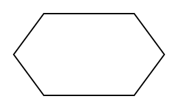
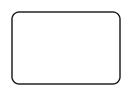
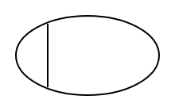
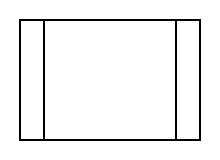
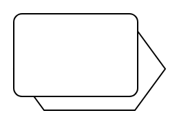
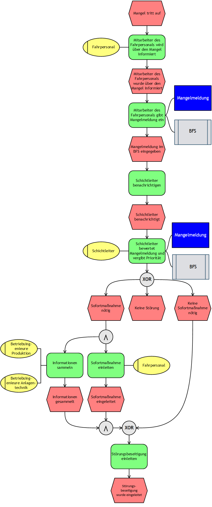
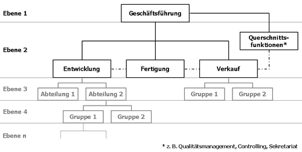

# EPK & eEPK 

Ereignisgesteuerte Prozessketten sind graphische Darstellungen von Prozessen in einer Organisation. Diese besteht primär aus Ereignissen, Funktionen und Konnektoren. Bei der erweiterten Ereignisgesteuerten Prozesskette (eEPK) werden zusätzlich Informationsobjekte und Organisationseinheiten angegeben. 

 

## Symbole / Knoten 

### Ereignis 
Ein Ereignis ist ein Zustand, der vor oder nach einer Funktion auftritt. Das Symbol ist ein gestrecktes Rechteck. Beispiel: "Auftrag ist angekommen." 

### Funktion 
Eine Funktion ist eine Aktion oder eine Aufgabe, auf die ein Ereignis folgt. Das Symbol ist ein Rechteck mit abgerundeten Kanten. Beispiel: "Auftrag prüfen"

### Konnektoren 
Konnektoren sind Logikgatter, die genutzt werden um den Kontrollfluss aufzuteilen. Verfügbare Konnektoren sind UND, ODER und XOR (Exklusiv-ODER). Das Symbol ist ein Kreis mit dem entsprechenden Symbol. 

| UND                 | ODER                  | XOR                 |
| ------------------- | --------------------- | ------------------- |
|  |  |  |

### Organisationseinheit (OE)
Mit Organisationseinheiten werden Rollen oder Abteilungen dargestellt. Niemals aber werden Personen oder Stellen namentlich erwähnt. Das Symbol ist eine Ellipse, die vor dem linken Rand eine senkrechte Linie enthält. Beispiel: "Marketingabteilung" 

### Informationsobjekt (IO) 
Eine Informationsobjekt stellt Dokumente oder andere Datenspeicher dar (z.B. Datenbanken). Das Symbol ist ein Rechteck. Beispiel: "Kundendatenbank" 

### Prozesswegweiser
Prozesswegweiser sind Hinweise auf andere Prozesse. Das Symbol ist ein Rechteck, hinter dem sich ein Sechseck verbirgt.

## Syntax 
|                                                                                                                                                                                                                                                                                                                                                                                                                                                                                                                               |                                |
| ----------------------------------------------------------------------------------------------------------------------------------------------------------------------------------------------------------------------------------------------------------------------------------------------------------------------------------------------------------------------------------------------------------------------------------------------------------------------------------------------------------------------------- | ------------------------------ |
| - Gelesen wird von oben nach unten - Beginn und Ende ist immer ein Ereignis - Organisationseinheiten und Informationsobjekte sind Symbole der eEPK - Der Informationsfluss wird durch Pfeile dargestellt - Ereignisse und Funktionen haben jeweils einen Ein- und Ausgang - Ausnahme: Anfangsereignis (kein Eingang), Endereignis (kein Ausgang) - Treffen mehrere Ereignisse auf eine Funktion, sind Konnektoren nötig - Ereignisse sind passiv, daher keine OR-/XOR-Aufspaltung zu mehreren Funktionen |  |

# Organigramme
Organigramme bilden die interne Struktur einer Organisation ab. Dabei werden Organisationseinheiten in verschiedene Ebenen unterteilt, so dass die Über- bzw. Unterordnung erkennbar ist. Genaue Symbole, Verbindungen oder Anordnungen sind nicht genormt.

# Finanzierung
Eine Finanzierung ist das Bereitstellen von Kapital an ein Unternehmen oder Privathaushalt, damit es seine Ziele verfolgen kann. 

## Innen
Eine Innenfinanzierung erfolgt durch innerbetriebliche Umsatzprozesse wie Abschreibungen oder Rückstellungen.

### Abschreibungsfinanzierung
Der Finanzierungseffekt von Abschreibungen besteht darin, dass das Unternehmen die Wertminderung von Anlagegütern in seine Verkaufspreise einkalkuliert. Bedeutet, dass z.B. gekaufte Fertigungsmaschinen durch den Verkauf der damit hergestellten Produkte finanziert wird.

### Rückstellungsfinanzierung
Unternehmen bilden Rückstellungen um drohende Verluste oder ungewisse Verbindlichkeiten ausgleichen zu können. Finanzierungscharakeristiken bilden sich dann, wenn diese Rücklagen beispliesweise für Pensionen oder Garantien angelegt werden.

Bei Pensionsrücklagen kann der Finanzierungseffekt in drei Phasen unterteilt werden:
1. *Expansionsphase:* Mithilfe von Gewinnen baut ein Unternehmen Pensionsrückstellungen auf. Pensionszahlungen sind noch nicht fällig bzw. nur in geringerem Ausmaß. Dadurch bildet sich eine wachsende Finanzierungsgrundlage.

2. *Ausgeglichene Phase:* Die Pensionszahlungen der auscheidenden Arbeitskräfte entsprechen etwa den Zuführungen für angestellte Arbeitskräfte. Die Finanzierungsgrundlage bleibt stabil.

3. *Kontraktionsphase:* Die Höhe der Pensionszahlungen übersteigt die der Angestellten. Ein negativer Finanzierungseffekt entsteht. Dieser kann eintreten, wenn z.B. Personal abgebaut wird.

## Außen
Wenn Unternehmen Finanzierungen durch andere Unternehmen oder Ähnlichem erhalten spricht man von Außenfinanzierung. Das erhaltene Kapital stammt also nicht aus dem Umsatzprozess des Unternehmens.

Das kann der Fall sein, wenn durch Unternehmer oder Gesellschafter Investitionen in das Unternehmen getätigt werden. Das wird als Eigenfinanzierung definiert. Wird Fremdkapital bezogen, also beispielsweise aus einem Bankkredit oder durch Unternehmensanleihen, wird von einer Fremdfinanzierung gesprochen.

### Darlehen
Darlehen, auch Kredit genannt, sind schuldrechtliche Verträge, bei dem ein Darlehensgeber einem Darlehensnehmer Geld oder Sachen zum Eigentum überträgt. Im Gegenzug ist der Darlehensnehmer dazu verpflichtet nach einer Frist oder bei Kündigung Geld oder Sachen gleicher Art, Güte und Menge an den Darlehensgeber zurückzugeben.

#### Endfälliges Darlehen
- Über die Laufzeit müssen nur Zinsen bezalh werden, Restschuld bleibt gleich
- Am Ende der Laufzeit muss die gesamte Restschuld bezahlt werden

Darlehensbetrag: 12.000€
Zinssatz: 5%
Laufzeit: 5 Jahre
|                     |          |
| :------------------ | :------- |
| Darlehensbetrag:    | 15.000€  |
| Zinssatz:           | 5%       |
| Laufzeit:           | 5 Jahre  |

| Jahr       | Restschuld | Zins       | Tilgung     | Zahlbetrag  |
| ----------- | ---------- | ---------- | ----------- | ----------- |
| 0           | 15.000€    | 750€       | 0           | 750€        |
| 1           | 15.000€    | 750€       | 0           | 750€        |
| 2           | 15.000€    | 750€       | 0           | 750€        |
| 3           | 15.000€    | 750€       | 0           | 750€        |
| 4           | 15.000€    | 750€       | 0           | 750€        |
| 5           | 0€         | 750€       | 15.000€     | 15.750€     |
| **Gesamt:** |            | **4.500€** | **15.000€** | **19.500€** |

#### Annuitätendarlehen
- Fester Zahlbetrag, zusammengesetzt aus Zins und Tilgung

|                     |          |
| :------------------ | :------- |
| Darlehensbetrag:    | 15.000€  |
| Zinssatz:           | 5%       |
| Anfangstilgunssatz: | 18,0974% |
| Laufzeit:           | 5 Jahre  |

| Jahr        | Restschuld  | Zins     | Tilgung    | Zahlbetrag      |
| :---------- | :---------- | :------- | :--------- | :-------------- |
| 1           | 15.000,00 € | 750,00 € | 2.714,61 € | 3.464,61 €      |
| 2           | 12.285,39 € | 614,27 € | 2.850,34 € | 3.464,61 €      |
| 3           | 9.435,05 €  | 471,75 € | 2.992,86 € | 3.464,61 €      |
| 4           | 6.442,19 €  | 322,11 € | 3.142,50 € | 3.464,61 €      |
| 5           | 3.299,69 €  | 164,98 € | 3.299,63 € | 3.464,61 €      |
| 6           | 0,06 €      | 0,00 €   | 3.464,61 € | 3.464,61 €      |
| **Gesamt:** |             |          |            | **20.787,66 €** |

#### Ratendarlehen
- Feste Tilgung, Zahlbetrag setzt sich aus Zins und Tilgung zusammen

|                     |          |
| :------------------ | :------- |
| Darlehensbetrag:    | 15.000€  |
| Zinssatz:           | 5%       |
| Laufzeit:           | 5 Jahre  |

| Jahr        | Restschuld | Zins | Tilgung | Zahlbetrag  |
| :---------- | :--------- | :--- | :------ | :---------- |
| 1           | 15.000€    | 750€ | 3.000€  | 3.750€      |
| 2           | 12.000€    | 600€ | 3.000€  | 3.600€      |
| 3           | 9.000€     | 450€ | 3.000€  | 3.450€      |
| 4           | 6.000€     | 300€ | 3.000€  | 3.300€      |
| 5           | 3.000€     | 150€ | 3.000€  | 3.150€      |
| **Gesamt:** |            |      |         | **17.250€** |

# Entscheidungsmatrix / Scoringmodell
# Projektmanagement
# Projektstrukturplan
## Gantt-Diagramm
## Netzplan
## ABC-Analyse
# Bestellpunktberechnung
# Bestellrythmusverfahren
# Einkaufskalkulation
# Handelskalkulation
# Handwerkskalkulation
# BAB / Industriekwk
# Zuschlagskalkulation
# Teilkostenrechnung / Deckungsbeitrag
# BEP / Make or Buy
# Bilanz / Rentabilität
# Unternehmensarten
# Marketing