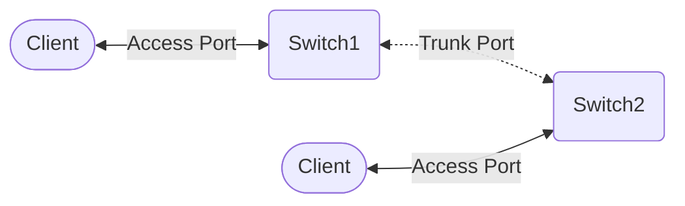

### IPv4

##### 1. Tabelle zeichnen

| Bits     | 1   | 2   | 3   | 4   | 5   | 6   | 7   | 8   |
| -------- | --- | --- | --- | --- | --- | --- | --- | --- |
| Zustände | 2   | 4   | 8   | 16  | 32  | 64  | 128 | 256 |

##### 2. Anzahl IPs errechnen & Zustände abgleichen

| Hosts | Alle IPs    |
| ----- | ----------- |
| 5     | $5 + 2 = 7 ≈ 8$ |
| 30    | $30 + 2 = 32 ≈ 32$ |

Bei 7 IPs nächste Gruppe 8. Weil $2^3=8$, 3 Bit Hostanteil.
Bei 32 IPs nächste Gruppe 32. Weil $2^5=32$, 5 Bit Hostanteil.

##### 3. Subnetzmaske errechnen

| Hosts | Alle IPs      | Subnetzmaske   |
| ----- | ------------- | -------------- |
| 5     | $5 + 2 = 7 ≈ 8$   | $32 - 3 = /29$ |
| 30    | $30 + 2 = 32 ≈ 32$ | $32 - 5 = /27$ |

##### 4. Subnetzmaske errechnen
1. Netzadresse
2. Subnetzmaske
3. Nächste Netzadresse = Netzadresse + Anzahl IPs
	- Netzadresse immer **gerade** Zahl
4. Broadcast = nächste Netzadresse -1
	- Broadcast immer **ungerade** Zahl
5. Erste & letzte IP Ausrechnen

| Netzadresse   | Maske | Broadcast     |
| ------------- | ----- | ------------- |
| 192.168.10.0  | /27   | 192.168.10.31 |
| 192.168.10.32 | /29   | 192.168.10.39 |

![[IPv4_Subnetzmaske.png|400]]

## DNS
![[DNS_Structure.png|400]]

| Typ   | Beschreibung                | Beispiel                             |
| ----- | --------------------------- | ------------------------------------ |
| A     | Domain Name  => IPv4        | example.com => 127.0.0.1             |
| AAAA  | Domain Name  => IPv6        | example.com => ::1                   |
| CNAME | Domain Name  => Domain Name | www.example.com => example.com       |
| ALIAS | Domain Name  => Domain Name | example.com => example.herokudns.com |
| TXT   | Kommentar                   |                                      |
| MX    | Mailserver                  | @ => ASPMX.L.GOOGLE.COM. 1           |

**TTL** = Time to Live
Wie lange die Record-Werte zwischengespeichert werden dürfen.
**Kürzer** = besser für Werte, die sich häufig ändern.
**Länger** = schnellere Auflösungszeit und weniger Traffic für deinen DNS-Server.

### Routing
**OSI-Layer:** Layer 3 (Network Layer)

#### Ablauf
1. **Ziel-IP prüfen:** Router analysiert die Ziel-Adresse im Header des IP-Pakets.
2. **Routing-Tabelle:** Abgleich der Ziel-IP mit Einträgen in der lokalen Tabelle.
3. **Longest Prefix Match:** Der Eintrag mit der genauesten Übereinstimmung (längste Subnetzmaske) gewinnt.
4. **Forwarding:** Paket wird an das nächste Interface (**Next Hop**) weitergeleitet.

#### Routing-Arten
- **Statisch:** Manuelle Einträge durch Admin. Sicher, aber unflexibel bei Fehlern.
- **Dynamisch:** Protokolle tauschen Infos selbstständig aus. Adaptiv bei Ausfällen.
- **Default Route:** (0.0.0.0/0) Der "Notnagel" – schickt alles, was nicht explizit bekannt ist, an ein Standard-Gateway (z. B. Internet-Router).

### IPv6

##### Adresskürzung
**3ffe:0123:0000:0000:0003:0dff:fe09:a688**
1. Alle führenden Nullen entfernen
3ffe:123:0:0:3:dff:fe09:a688
2. Ein Bereich mit 0000 darf komplett gekürzt werden
3ffe:123::0:3:dff:fe09:a688

##### Adressformate
![[IPv6_Adressformate.png|300]]

##### EUI-64 - MAC als Interface ID
![[IPv6_EUI-64.png|300]]
1. In der Mitte der MAC-Adresse 0xfffe einfügen
2. 7. Bit auf 1 setzen

##### IPv4 Kompatibilität
**Dual Stack** Simultanbetrieb von IPv4 & IPv6
**Tunneling** IPv6 Pakete werden in IPv4 Pakete eingepackt
**Translation** Stateless IP/ICMP Übersetzung mit NAT Protocol Translation

### OSI
![[OSI.jpg]]

### VLAN
Logische Unterteilung in mehrere Teilnetze durch zusätzlichen Tag im Ethernet-Frame.

| **Vorteile**                                    | **Nachteile**              |
| ----------------------------------------------- | -------------------------- |
| Weniger Broadcastauslastung                     | Höhere Hardwareanforderung |
| Erhöhte Sicherheit<br>(Authenticity, Integrity) | Mehr Konfigurationsaufwand |
| Mehr Flexibilität                               | Komplexere Fehlersuche     |

| Access Port     | Trunk-Ports       |
| --------------- | ----------------- |
| untagged Frames | tagged Frames     |
| ein VLAN/Port   | mehrere VLAN/Port | 



### Firewall
- **Paketfilter (Statisch)**
	- **OSI-Schicht** 3
	- Filtert Paket-Header nach IPs, Ports, Protokollen
	- **Pro:** Schnell, ressourcenschonend
	- **Contra:** Kein Kontextverständnis, keine Inhaltsprüfung, anfällig für manipulierten Traffic
- **Stateful Inspection Firewall (Dynamisch)**
	- **OSI-Schicht** 3&4
	- Erlaubt Antwortpakete auf aktive Sitzungen (State Table)
	- **Pro:** Hohe Sicherheit durch Kontextwissen
	- **Contra:** Anfällig für DoS-Angriffe (State Table kann überlaufen), langsamer als reine Paketfilter
- **Application-Level Firewall (Proxy-Firewall)**
	- **OSI-Schicht:** 7
	- Stellvertreter-Prinzip, prüft Payload auf Anwendungsebene
	- **Pro:** versteht Protokolle (HTTP, FTP, SMTP), verbirgt interne Netzwerk komplett.
	- **Contra:** Deutlich langsamer, benötigt viele Hardwareressourcen, komplexe Einrichtung
- **Next-Generation Firewall**
	- **OSI-Schicht:** 3 bis 7
	- klassische Firewall-Funktionen Sicherheitsfeatures. Nutzt Deep Packet Inspection und oft integrierten Virenschutz
	- **Pro:** bester Schutz, tiefe Sichtbarkeit des Traffics
	- **Contra:** Teuer, regelmäßige Updates, komplexe Einrichtung

### DMZ
Isoliertes Teilnetzwerk, als Sicherheitspuffer zwischen unsicheren Netzwerk und dem sicheren LAN

**Dual-Firewall-Architektur**
- **Aufbau:** Zwei separate Firewalls, DMZ in der Mitte.
- **Pro:** Höchste Sicherheit, wenn Firewalls von zwei Herstellern genutzt (Vermeidung von Fehlern, die beide Systeme betreffen).
- **Contra:** Teurer und mehr administrativer Aufwand.

**Single-Firewall-Architektur**
- **Aufbau:** Eine Firewall mit drei separaten Netzwerkschnittstellen: Eins Internet, eins DMZ, eins LAN.
- **Pro:** Günstiger, weniger Hardware, einfachere Verwaltung
- **Contra:** Single Point of Failure
![[DMZ_Vergleich.jpg|400]]

### VPN
Verschlüsselte Verbindung durch unsicheres Netzwerk.

**Arten:** Site-to-Site, End-to-Site, End-to-End
**Protokolle:** IPsec, SSL/TLS, WireGuard
**Schutzziele:** Vertraulichkeit, Integrität, Authentizität
**Betriebsmodi:**
- Tunnel Mode: Einpacken eines Datenpakets in ein Neues.
	- Full Tunneling
	- Split Tunneling
- Transport Mode: Nur Payload wird verschlüsselt, Header bleibt. Weniger Bandbreite benötigt, dafür Traffic Analyse möglich.

### Verschlüsselung
1. Symetrisch
	- 1 Schlüssel für Ver- & Entschlüsseln
	- **Pro:** schnell, effizient bei großen Datenmengen
	- **Contra:** Schlüsselaustausch-Problem
	- **Algorithmen:** AES, 3DES, ChaCha20
2. Asymetrisch
	- Schlüsselpaare
		- Public Key: Nur Verschlüsseln
		- Private Key: Nur Entschlüsseln
	- **Pro:** Kein Schlüsselaustausch-Problem, ermöglicht Signaturen
	- **Contra:** rechenintensiv, ca. 1000mal langsamer als sym
	- **Algorithmen:** RSA, ECC

### WLAN Sicherheit
1. **WEP:** Seit 1999, Verschlüsselung gebrochen
2. **WPA:** Übergangslösung, Verschlüsselung gebrochen
3. **WPA2**
	- AES-Verschlüsselung
	- 4-Way-Handshake bei Anmeldung kann abgefangen und nachgestellt werden
4. **WPA3**: Simultaneous Authentication of Equals

Authentifizierungs-Modi:
- Personal-Mode (WPA-PSK): Pre-Shared Key
- Enterprise-Mode (WPA-802.1X): User Based Authentification, z.B. durch RADIUS-Server

### Schutzziele
- **Vertraulichkeit** (confidentiality): Nur Autorisierte dürfen auf Daten zugreifen.
- **Integrität** (integrity): Daten dürfen nicht unbemerkt verändert werden. Änderungen müssen nachvollziehbar sein.
- **Verfügbarkeit** (availability): Der Zugriff auf Daten muss gewährt werden, Systemausfälle verhindert.
- **Authentizität** (authenticity): Ist z.B. die Person auch die für die sie sich ausgibt?

**Methoden**
- Verschlüsselung
- Identitäts- und Zugriffsmanagement
- Endgerätesicherheit
- Backups & Redundanzen

### Projektmerkmale (SMART)
Ein Projekt zeichnet sich durch Einmaligkeit, Zielvorgabe sowie zeitliche, finanzielle und personelle Begrenzung aus.
- **S**pezifisch (Eindeutig definiert)
- **M**essbar (Kriterien zur Überprüfung)
- **A**ttraktiv/Akzeptiert (Gern auch: Angemessen)
- **R**ealistisch (Machbarkeit)
- **T**erminiert (Klares Ende)

### Cyberphysische Systeme

Ein CPS ist die Verzahnung des **physischen (mechanischen)** mit dem **digitalen**. Das System beobachtet die reale Welt, verarbeitet die Daten und greift anschließend wieder physisch in die reale Welt ein.

**Bestandteile:**
1. **👀 Sensoren** (z. B. Temperatur, Druck, Bewegung)
2. **🧠 Embedded Systems:** Eingebettete Mikrocontroller zur Echtzeitauswertung
3. **🌐 Netzwerk**
4. **💪 Aktoren**

**Praxisbeispiele**
- **Autonomes Fahren:** Kameras/Radar (Sensoren) scannen die Straße ➔ Bordcomputer (IT) berechnet den Weg ➔ Lenkung/Bremsen (Aktoren) reagieren in Echtzeit.
- **Industrie 4.0 (Smart Factory)**

### Virtualisierung
**Hypervisor:** Teilt Ressourcen (CPU, RAM, Festplatte, Netzwerk) virtuelle Maschinen auf

Arten:
- **Bare-Metal Hypervisor**: Hypervisor direkt auf physischer Hardware installiert
- **Hosted Hypervisor**: Hypervisor als Anwendung

Container vs. VM
1. VM: Virtualisiert die **komplette Hardware**
2. Virtualisiert **nur das Betriebssystem**

### Raid
![[RAID_0.svg.png|100]] ![[RAID_1.svg.png|100]]
![[RAID_5.svg.png|200]] ![[RAID_6.svg.png|250]]

### Handelskalkulation
|**Schritt**|**Bezeichnung**|**Rechenweg**|
|---|---|---|
|1|**Listeneinkaufspreis (netto)**|(Basiswert vom Lieferanten)|
|2|- Lieferantenrabatt|LEP $\times$ Rabattsatz|
|3|**= Zieleinkaufspreis**|LEP - Rabatt|
|4|- Lieferantenskonto|ZEP $\times$ Skontosatz|
|5|**= Bareinkaufspreis**|ZEP - Skonto|
|6|+ Bezugskosten (Fracht, Porto)|(fixer Betrag)|
|7|**= Einstandspreis (Bezugspreis)**|BEP + Bezugskosten|
|8|+ Handlungskostenzuschlag|Einstandspreis $\times$ HK-Satz|
|9|**= Selbstkostenpreis**|Einstandspreis + Handlungskosten|
|10|+ Gewinnzuschlag|Selbstkosten $\times$ Gewinnsatz|
|11|**= Barverkaufspreis**|Selbstkosten + Gewinn|
|12|+ **Kundenskonto**|BVP $\times$ (Skontosatz / (100 - Skontosatz))|
|13|**= Zielverkaufspreis**|BVP + Kundenskonto|
|14|+ Kundenrabatt|ZVP $\times$ (Rabattsatz / (100 - Rabattsatz))|
|15|**= Nettoverkaufspreis (LVP)**|ZVP + Kundenrabatt|
|16|+ Umsatzsteuer (MwSt)|Nettoverkaufspreis $\times$ Steuersatz|
|17|**= Bruttoverkaufspreis**|Nettoverkaufspreis + MwSt|

### Return on Investment (ROI)
Gibt an, wie effizient das eingesetzte Kapital arbeitet.
$$ROI = \frac{\text{Gewinn}}{\text{Investitionskapital}} \times 100$$
**Amortisationszeit:** Zeitraum, bis die Gewinne die Anschaffungskosten decken ($Investition / Gewinn\text{ pro Jahr}$).

### Netzplan & Gantt
- **Gantt-Diagramm:** Zeitstrahl-Darstellung. Zeigt, **wann** Aufgaben erledigt werden und deren Dauer/Überschneidung.
- **Netzplan (Kritischer Pfad):** Fokus auf logische Abhängigkeiten.
    - **FAZ / FEZ:** Frühester Anfangs-/Endzeitpunkt.
    - **SAZ / SEZ:** Spätester Anfangs-/Endzeitpunkt.
    - **Gesamtpuffer:** $SAZ - FAZ$. Ist der Puffer **0**, liegt der Vorgang auf dem **Kritischen Pfad** (Verzögerung hier schiebt das Projektende).

### eEPK
- **Ereignis:** Zustand (vor/nach einer Funktion). _Bsp: "Rechnung eingetroffen"_.
- **Funktion:** Tätigkeit/Aktion. _Bsp: "Rechnung prüfen"_.
- **Konnektoren:**
    - **AND (∧):** Alle Zweige müssen erfüllt sein.
    - **OR (∨):** Mindestens ein Zweig muss erfüllt sein.
    - **XOR (⊕):** Genau ein Zweig muss erfüllt sein (Entscheidung).
- **Regel:** Eine eEPK startet und endet immer mit einem **Ereignis**. Auf ein Ereignis darf kein XOR/OR folgen (da Ereignisse keine Entscheidungen treffen).

### SQL Basics
**Abfrage:**
```SQL
SELECT spalte FROM tabelle 
WHERE bedingung 
ORDER BY spalte ASC/DESC;
```
**Änderung:**
```SQL
INSERT INTO Tabelle (Spalte1, Spalte2, ...)  
VALUES (Spalte1, Spalte2, ...);
```
```SQL
UPDATE Tabelle  
SET Spalte1 = Wert, Spalte2 = Wert, ...  
WHERE Bedingung;
```
```SQL
DELETE FROM Tabelle WHERE Bedingung;
```

- **Joins:** * `INNER JOIN`: Nur Treffer in beiden Tabellen.
    - `LEFT JOIN`: Alles von links, nur Treffer von rechts.
- **Aggregatfunktionen:** `COUNT()`, `SUM()`, `AVG()`, `GROUP BY` (wichtig für Filterung nach Funktionen).

### Normalformen (Datenintegrität)
**1. NF:** Alle Attribute sind **atomar** (keine Aufzählungen in einem Feld) und eindeutig.
**2. NF:** 1. NF erfüllt + jedes Nicht-Schlüsselattribut ist von **jedem Teil** des Primärschlüssels voll funktional abhängig (relevant bei zusammengesetzten Schlüsseln).
**3. NF:** 2. NF erfüllt + keine **transitiven Abhängigkeiten** (Nicht-Schlüsselattribute dürfen nicht voneinander abhängen).

### ER-Diagramme (Entity-Relationship)

- **Rechteck:** Entität (Objekt, z. B. "Kunde")
    
- **Ellipse:** Attribut (Eigenschaft, z. B. "Name")
    
- **Raute:** Beziehung (Verbindung, z. B. "kauft")
    
- **Kardinalitäten:**
    
    - **1:1:** Ein Chef leitet eine Abteilung.
        
    - **1:n:** Ein Kunde hat viele Bestellungen.
        
    - **m:n:** Viele Studenten besuchen viele Kurse (erfordert Hilfstabelle in SQL).

### NoSQL (Not Only SQL)

**Hauptmerkmale:**

- **Schema-frei:** Daten müssen nicht in starre Tabellen passen; jedes Dokument kann unterschiedliche Felder haben.
    
- **Skalierbarkeit:** Optimiert für **horizontale Skalierung** (Verteilung auf viele günstige Server statt eines großen).
    
- **BASE statt ACID:** Fokus auf Verfügbarkeit (_Availability_) und Schnelligkeit statt strikter Konsistenz

|**Typ**|**Beschreibung**|**Beispiel-Systeme**|
|---|---|---|
|**Document Store**|Speichert Daten als Dokumente (meist **JSON** oder BSON). Ideal für Web-Apps.|MongoDB, CouchDB|
|**Key-Value Store**|Einfachste Form: Ein eindeutiger Schlüssel zeigt auf einen Wert. Extrem schnell.|Redis, Amazon DynamoDB|
|**Wide-Column Store**|Speichert Daten in Spaltenfamilien statt Zeilen. Optimiert für riesige Datenmengen.|Cassandra, HBase|
|**Graph Database**|Fokus auf Beziehungen zwischen Datenpunkten (Knoten & Kanten).|Neo4j, ArangoDB|