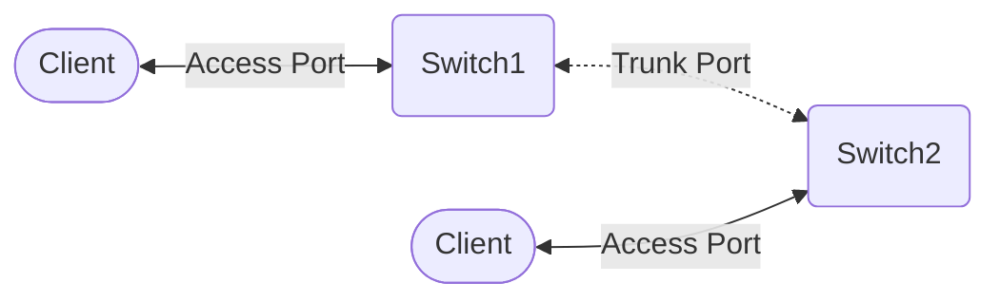

![[IPv4_Subnetzmaske.png]]

### 1. Tabelle zeichnen

| Bits     | 1   | 2   | 3   | 4   | 5   | 6   | 7   | 8   |
| -------- | --- | --- | --- | --- | --- | --- | --- | --- |
| Zustände | 2   | 4   | 8   | 16  | 32  | 64  | 128 | 256 |

### 2. Anzahl IPs errechnen

| Hosts | Alle IPs    |
| ----- | ----------- |
| 5     | 5 + 2 = 7   |
| 30    | 30 + 2 = 32 |

### 3. Zustände abgleichen
Bei 7 IPs ist die nächste Gruppe 8. Weil $2^3=8$, 3 Bit Hostanteil.
Bei 32 IPs ist die nächste Gruppe 32. Weil $2^5=32$, 5 Bit Hostanteil.

### 4. Subnetzmaske errechnen
| Hosts | Alle IPs      | Subnetzmaske   |
| ----- | ------------- | -------------- |
| 5     | $5 + 2 = 7 ≈ 8$   | $32 - 3 = /29$ |
| 30    | $30 + 2 = 32 ≈ 32$ | $32 - 5 = /27$ |

### 5. Adressen ausrechnen
Wenn nicht anders vorgegeben, beginnend mit der größten Adresse.
1. Netzadresse aufschreiben
2. Maske aufschreiben
3. Netzadresse des nächsten Netzes errechnen (Netzadresse + Anzahl max IPs)
	- Merke: **Netz**adressen sind immer **grade Zahlen**
4. Broadcast ausrechen (Netzadresse nächstes Netz - 1)
	- Merke: **Broadcast**adressen sind immer **ungrade Zahlen**
5. Erste und letzte IP ausrechnen, falls benötigt

| Netzadresse   | Maske | 1. IP         | letzte IP     | Broadcast     |
| ------------- | ----- | ------------- | ------------- | ------------- |
| 192.168.10.0  | /27   | 192.168.10.1  | 192.168.10.30 | 192.168.10.31 |
| 192.168.10.32 | /29   | 192.168.10.33 | 192.168.10.38 | 192.168.10.39 |

