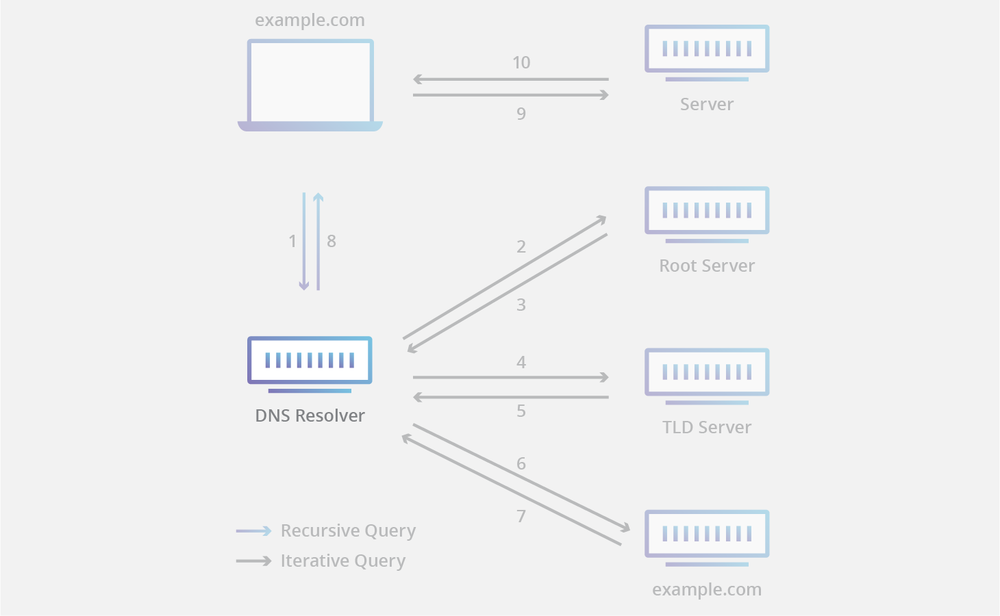
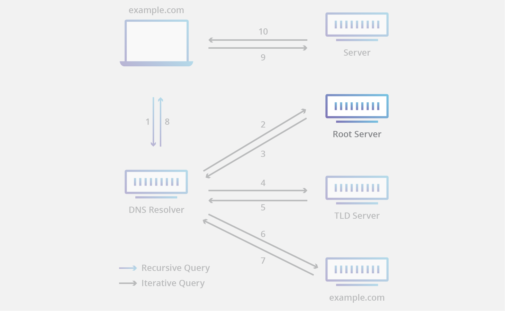
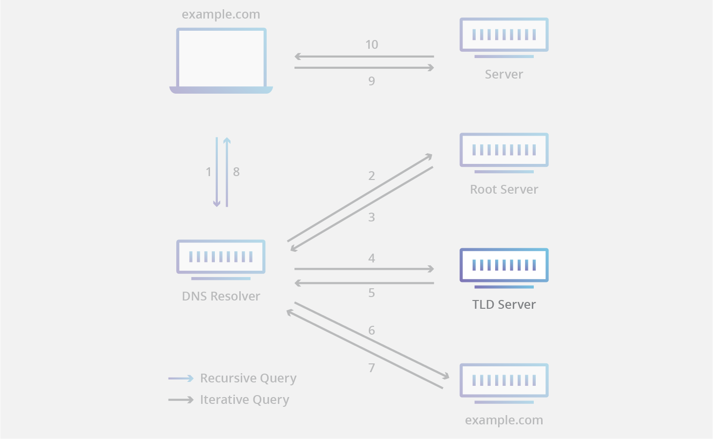
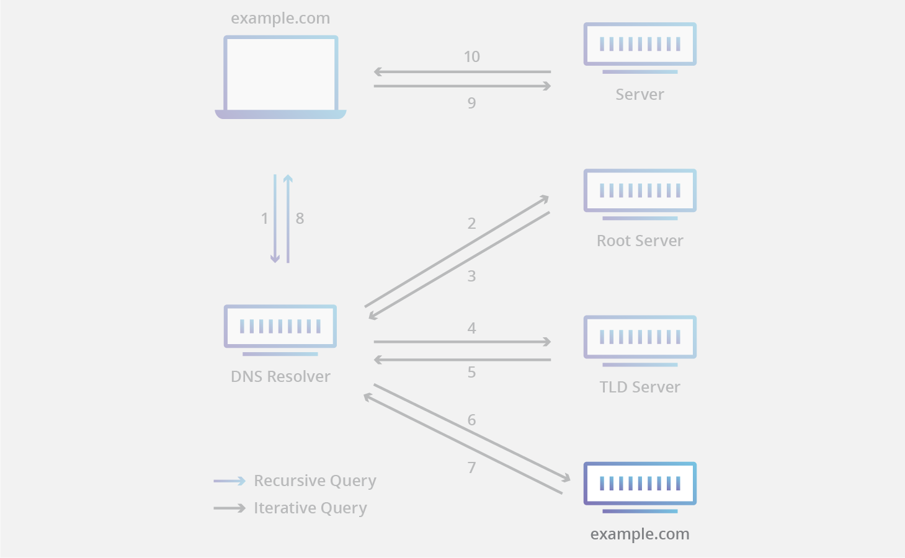
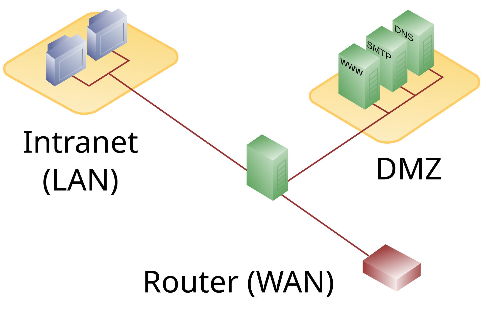
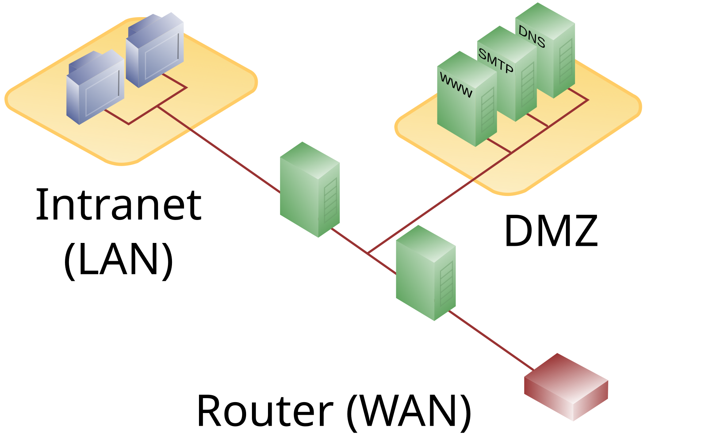
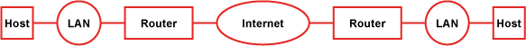
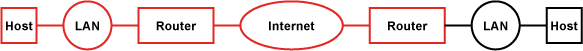
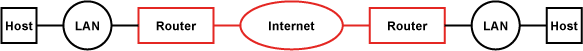
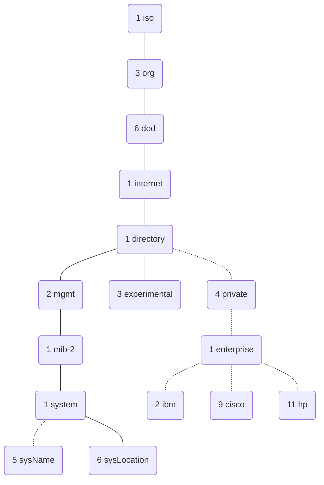

# DNS 
Das Domain Name System ist ein hierarchisches, dezentrales Namenssystem, das Domainnamen in IP-Adressen (und umgekehrt) auflöst. 

## Domain-Name
Der Domain-Name dient dazu die IP-Adresse des verknüpften Hosts für den Menschen lesbar zu machen und gleichzeitig diese in eine hierarchische Struktur einzuteilen. 

### Struktur 
Domain-Namen werden von rechts nach links gelesen, offiziell beginnt er mit einem Punkt, der als "root" bezeichnet wird. 

|Hostname|Sub-Level-Domain|Second-Level-Domain (SLD)|Top-Level-Domain (TLD)|Beschreibung|
|--------|----------------|-------------------------|----------------------|------------|
|www.||google.|de.|Domain-Name von der deutschen Google Seite|
|www.|maps.|google.|de.|"Unterseite" von Google -> Google Maps|
|Desktop-FDHQRZ.||Orga.|de.|Domain-Name eines Clients in der Domain "Orga.de."

Die Top-Level-Domain kann geografisch (Country-Code Top-Level-Domains ccTLD) oder generisch (generic Top-Level-Domain gTLD) sein. Eine Second-Level-Domain kann von Personen oder Organisationen beantragt und verwendet werden. Sie bildet dann unter der TLD einen Namensraum, der es ermöglicht Server in diesem bereit zu stellen. Die SLD kann weiter in Sub-Level-Domains unterteilt werden. Um einen speziellen Host in einer Domain ansprechen zu können wird diesem zusätzlich noch ein Name zugewiesen. Dieser ist bei Websites oft "www.", die meisten Web-Browser benötigen diesen nicht immer um auf websites zuzugreifen. 

## DNS-Zonen 
DNS-Zonen sind Verwaltungsbereiche, die in der Regel an einen Teil eines Domain-Namens gebunden ist. Ein autoritativer DNS-Server ist für eine oder mehrere dieser DNS-Zonen verantwortlich. Autoritative DNS-Server können DNS-Anfragen eindeutig und korrekt zu ihrer Zonen beantworten. Die Daten dazu liegen in einer lokalen zone file, in dieser resource records enthalten sind.

## resource records
In resource records sind die Informationen enthalten, die der DNS-Server bei Anfragen zurück gibt. 

|Name|TTL|Class|Type|RDATA|Type|
|----|---|-----|----|-----|----|
|www.google.com.|3600|IN|A|142.251.143.4|FQDN -> IPv4|
|www.google.com.|3600|IN|AAAA||FQDN -> IPv6|

## DNS-Server 
Klassischerweise gibt es vier verschiedene Arten von DNS-Servern. 

### Rekursiver Resolver
Ein rekursiver Resolver kann bei Anfragen entweder mit gecachten DNS records antworten oder eine Anfrage an einen root nameserver stellen. Dieser vermittelt dann den zuständigen TLD server. Eine weitere Anfrage vom DNS resolver an diesen liefert dann Informationen über den zuständigen autorativen nameserver. Letztendlich kann dieser autorativer nameserver die benötigten Informationen über den gesuchten Server liefern.

### root Nameserver
Jeder rekursive Resolver kennt die 13 DNS-Stamm-Nameserver. Sie sind deren erste Station auf der Suche nach DNS-Einträgen. Ein Stammserver akzeptiert die Abfrage eines rekursiven Resolvers, die einen Domain-Namen enthält. Anhand der Erweiterung dieser Domain (.com, .net, .org usw.) beantwortet er die Abfrage und leitet den rekursiven Resolver an den zuständigen TLD-Nameserver weiter. Die Stamm-Namenserver werden durch eine internationale gemeinnützige Organisation namens Internet Corporation for Assigned Names and Numbers (ICANN) überwacht.

Obwohl es nur 13 Stamm-Nameserver gibt, bedeutet das nicht, dass das Stamm-Nameserver-System nur 13 Rechner umfasst. Es gibt 13 Typen von Stamm-Nameservern, von denen jeweils mehrere Kopien weltweit vorhanden sind, die mittels Anycast-Routing schnelle Antworten bereitstellen. Wenn Sie alle Instanzen von Root-Nameservern zusammenzählen würden, kämen Sie auf über 600 verschiedene Server.

### TLD Nameserver
Ein TLD-Nameserver verwaltet die Informationen zu allen Domain-Namen, die über die gleiche Erweiterung verfügen, z. B. .com, .net oder eine andere Zeichenfolge nach dem letzten Punkt in einer URL. Beispielsweise enthält ein TLD-Nameserver für .com Informationen zu allen Websites, die auf „.com“ enden. Wenn ein Benutzer nach google.com sucht, sendet der rekursive Resolver, nachdem er eine Antwort von einem Stamm-Nameserver erhalten hat, eine Abfrage an einen für .com zuständigen TLD-Nameserver. Dieser verweist in seiner Antwort dann auf den autoritativen Nameserver für diese Domain (siehe unten).

Die Verwaltung der TLD-Nameserver obliegt der Internet Assigned Numbers Authority (IANA), einem Zweig der ICANN.

### autorativer Nameserver
Wenn ein rekursiver Resolver eine Antwort von einem TLD-Nameserver erhält, verweist ihn die Antwort auf einen autoritativen Nameserver. Der autoritative Nameserver ist für gewöhnlich die letzte Station auf der Reise zu einer IP-Adresse. Der autoritative Nameserver enthält Informationen, die dem Domainnamen (z. B. google.com), für den er zuständig ist, eigen sind. Er kann einem rekursiven Resolver die IP-Adresse des Servers, die im DNS-A-Eintrag enthalten ist, liefern. Wenn die Domain über einen CNAME-Eintrag (Alias) verfügt, stellt er dem rekursiven Resolver eine Alias-Domain bereit. In diesem Fall muss der rekursive Resolver einen ganz neuen DNS-Lookup starten, um sich einen Eintrag von einem autoritativen Nameserver zu beschaffen (das ist oft ein A-Eintrag mit einer IP-Adresse). Cloudflare DNS verteilt die autoritativen Nameserver, die beim Anycast-Routing berücksichtigt werden, um die Zuverlässigkeit zu erhöhen.

# DHCP 
Das Dynamic Host Configuration Protocol wird genutzt um IP-Adressen in einem Netzwerk zu verwalten und zu verteilen. DHCP als Protokoll agiert auf OSI-Schicht 7 (Application), steuert aber auf Schicht 2 (Data-link). 

## DHCPv4 

### Discover:
Host schickt ein UPD Paket mit der Zieladresse 255.255.255.255 und der Quelladresse 0.0.0.0 in das Netzwerk. 

### Offer: 
Ein zuständiger DHCP-Server antwortet mit folgenden Daten: 
- MAC-Adresse des Clients 
- Zugewiesene IP-Adresse 
- Lease-Time (Laufzeit der IP-Adresse) 
- Subnetzmaske 
- IP-Adresse des DHCP-Servers 

### Request: 
Falls ein Host mehrere Offers erhalten hat sucht der Client sich eine IP-Adresse heraus. Dementsprechend wird dann eine positive Meldung an den betreffenden DHCP-Server versand. 

### Acknowledgement: 
Die Vergabe der IP-Adresse wird durch den DHCP-Server bestätigt. Falls konfiguriert werden jetzt auch zusätzliche Informationen wie DNS, Domain Name, Time Server oder Ähnliches. 

# Schutzziele 
Informationen sind schützenswerte Güter. Der Zugriff auf diese sollte beschränkt und kontrolliert sein. Um das zu erreichen existieren sogenannte Schutzziele. 

## Vertraulichkeit 
Daten dürfen lediglich von autorisierten Benutzern gelesen werden, das für gespeicherte Daten als auch für Datenübertragungen. 
**Beispiele:** Verschlüsselung, User-based authentication 

## Integrität 
Daten dürfen nicht unbemerkt verändert werden. Alle Änderungen müssen nachvollziehbar sein. 
**Beispiele:** Prüfsummen bei der Datenübertragung, Firewall, Virenschutz, Netzwerksegmentierung (VLANs) und VPNs für die Systemintegrität. 

## Verfügbarkeit 
Verhinderung von Ausfällen, der Zugriff auf Daten muss innerhalb eines vereinbarten Zeitraums gewährleistet sein. Gemessen werden kann die Verfügbarkeit mithilfe folgender Formel: 

**Beispiel:** Redundanzen, Schutz vor Überbelastung 

## Authentizität 
Bei der Datenübertragung sollte genau feststellbar sein, dass die Daten auf wirklich von richtigen Sender übermittelt wurden und keinem Dritten. 
**Beispiel:** digitale Signaturen, 2FA 

# Firewall 
Eine Firewall ist ein Sicherungssystem, das ein Netze oder einzelne Clients vor unerwünschten Netzwerkzugriffen schützt. Sie agiert auf OSI-Schicht 3 & 4. 

## Arten 
### Paketfilter 
Datenpakete werden anhand des Headers interpretiert und je nach eingestelltem Filter verworfen (DROP), zurückgewiesen mit einer ICMP-Nachricht (REJECT), weitergeleitet (FORWARD) oder durchgelassen (ALLOW). Statefull Filter erstellen für ausgehende Pakete automatisch Regeln in der in einer bestimmten Zeit Antworten auf dieses Paket erlaubt ist. 

### Packet-Inspection  
Analysiert den eigentlichen Anwendungs‑Payload (HTTP, FTP, SMTP, DNS usw.). Hier können Inhalte, Befehle, URLs oder sogar spezifische Anwendungs‑Protokoll‑Parameter geprüft werden. 

### Next-Genration 
Next-Generation arbeiten Statusunabhängig und betrachtet den gesamten Datenverkehr. Durch Untersuchung der Daten innerhalb der vier TCP/IP-Kommunikationsebenen (Anwendung, Transport, IP-Netzwerk und Hardware). Dadurch bieten viele Next-Gen Firewalls auch einen besseren DDoS (Distributed Denial of Service) Schutz. 

## DMZ 
Eine Demilitarized Zone (DMZ) ist ein separates Netzwerksegment zwischen zwei Netzwerken (z. B. LAN und Internet). Sie wird durch eine oder zwei Firewalls vom internen Netzwerk abgeschirmt und dient dazu, Server oder Dienste mehreren Netzwerken – insbesondere dem Internet – kontrolliert zur Verfügung zu stellen. 
### Einstufige DMZ: 

Zweistufige DMZ: 

# Proxy 
Ein Proxy ist ein Vermittler zwischen zwei Netzwerken. Ähnlich wie bei einem NAT-Gerät werden Anfragen eines Clients angenommen und im Namen des Proxys an das Ziel weitergeleitet. Jedoch anders als bei einem NAT-Gerät kann ein Proxy-Server die Kommunikation beeinflussen. Teilweise können Daten analysiert, Anfragen gefiltert oder anderweitig angepasst werden.  
Proxys werden als protokollunabhängiger Filter als Teil einer Firewall eingesetzt. Hier übernimmt er dir port- adressbasierte Filterung. 
Proxys agieren auf der OSI-Schicht 7 (Application). 

# OSI-Schichtenmodell 
Mit dem OSI-Schichtenmodell kann Kommunikation in bestimmte Layers (Zonen) eingeordnet werden. Damit können Protokolle und Dienste in den Schichten Standardisiert und Fehler leichter diagnostiziert werden. 
| OSI-Schicht | Bezeichnung  | DoD-Modell  | Protokollbeispiele                                  | Kopplungselemente              |
| ----------- | ------------ | ----------- | --------------------------------------------------- | ------------------------------ |
| 7           | Application  | Application | HTTP, HTTPS, FTP, DNS, DHCP, SMTP, IMAP, MQTT, LDAP | Gateway, Proxy, Content-Switch |
| 6           | Presentation | Application |                                                     |                                |
| 5           | Session      | Application |                                                     |                                |
| 4           | Transport    | Transport   | TCP, UDP, SCTP                                      |                                |
| 3           | Network      | Internet    | IP, ICMP, IPsec                                     | Router, Layer-3-Switch         |
| 2           | Data Link    | Link        | IEEE 802.3 (Ethernet), IEEE 802.11 (WLAN), MAC      | Wireless AP, Layer-2-Switch    |
| 1           | Physical     | Link        | 1000BASE-T Glasfaser                                | Kabel, Repeater, Hub, Antennen |

# VPN
Eine VPN, auch Virtual Private Network, ist eine Netzwerkverbindung, die von Unbeteiligten nicht einsehbar ist. Eine VPN agiert also wie ein Verbindungskabel durch ein anders Netzwerk (z.B. das Internet), um einen direkten Zugriff auf Netzwerkressourcen zu gewährleisten (z.B. Dienste im Firmen LAN). Vorteil ist hier die Erfüllung des Schutzzieles der Vertraulichkeit, solange die VPN-Server vertraulich sind. Nachteilig ist, dass durch die zusätzliche Verschlüsselung mehr Bandbreite benötigt wird und Latenzen steigen.  

## Arten 
### Host to Host 
Bei Host to Host VPNs werden zwei Hosts direkt miteinander verbunden. Damit kann z.B. ein Fernzugang auf einen Firmenrechner gewährleistet werden. 

### Host to Site 
Host to Site VPNs verbinden einzelne Hosts mit einem gesamten Netzwerk, z.B. ein Remotelaptop mit dem Firmennetz um auf lokale E-Mail-Server zugreifen zu können. 

### Site to Site 
Site to Site VPNs werden eingesetzt um zwei physikalisch getrennte Standorte miteinander zu verbinden.  Statt einzelne Clients zu verbinden verwaltet der Router das VPN-Routing. 

# Protokolle 

## IPsec 
IPsec ist eine Erweiterung des Internet-Protokolls um Verschlüsselungs- und Authentifizierungsmechanismen. Damit können IP-Pakete kryptografisch gesichert über öffentliche Netzwerke transportiert werden. Dadurch eignet sich dieses Protokoll besonders für VPN-Anwendungen.  

## SSL/TLS 
Transport Layer Security, auch bekannt unter der Vorgängerbezeichnung Secure Sockets Layer, ist ein Verschlüsselungsprotokoll zur sicheren Datenübertragung im Internet. Wie im RFC: 8446 beschrieben ist das Ziel von TLS einen sicheren Kommunikationskanal zwischen zwei Endpoints aufzubauen. TLS wird unter anderem von HTTPS genutzt. 

1. **ClientHello:**   Der Client startet die Verbindung und sendet:
    - TLS-Version
    - 32-Byte Zufallszahl
    - unterstützte Cipher Suites (Algorithmen für Schlüsselaustausch, Verschlüsselung, Authentifizierung)
    - ggf. Diffie-Hellman Key-Shares

2. **ServerHello:**   Der Server antwortet mit:
    - ausgewählter Cipher Suite
    - Server-Zertifikat
    - Signatur (Hash des ClientHello mit dem privaten Schlüssel des Zertifikats)

3. **Zertifikatsprüfung:**   Der Client prüft:
    - Gültigkeit des Zertifikats
    - Signatur des Servers   → Bei Fehler wird die Verbindung abgebrochen.

4. **Schlüsselaushandlung:**  
    Client und Server handeln – abhängig von der Cipher Suite – ein gemeinsames Pre-Master-Secret aus (z. B. über Diffie-Hellman).

5. **Session-Schlüssel:**  
    Aus dem Pre-Master-Secret wird ein Master-Secret abgeleitet, das als Session Key für die verschlüsselte Kommunikation dient.

# Virtualisierung
Um verschiedene Dienste bereitzustellen benötigt es meist mehrere verschiedene Server. Um nicht für jeden Dienst einen eigenen, dedizierten Server bereitstellen zu müssen gibt es die Möglichkeit zu Virtualisieren. Dabei wird Hard- oder Software emuliert, um mit einem physischen Server (dem Host) mehrere Betriebssysteme bereitzustellen. Die virtualisierten Systeme nennt man Virtuelle Maschinen (VM).

**Vorteile:**
- weniger Hardware benötigt
- bessere Ausnutzung der Ressourcen durch effizentere Verteilung
- bessere Skalierbarkeit

**Nachteile:**
- höheres Single Point of Failure Risiko
- komplexere Verwaltung
- Performance-Einbußen

## Hypervisor
Als Hypervisor bezeichnet man die Schicht zwischen Hardware des Hostsystems und den virtualisierten Gastsystemen. Mit einem Hypervisor können Virtuelle Maschinen erstellt und verwaltet werden. Dabei werden die vorhandenen Ressourcen auf die Gastsysteme verteilt.

# SNMP
Je komplexer eine Netzwerkinfrastruktur wird, desto aufwändiger wird es Netzwerkelemente (z.B. Router, Server, Switches, etc) zu überwachen und verwalten. Dafür wurde das Simple Network Management Protocol, kurz SNMP entwickelt. Dabei regelt das Protokoll die Kommunikation zwischen den überwachten Geräten und der Netzwerkmanagement-Station.

## Versionen
1. SNMPv1
    - Fünf Protokolloperationen (PDU): 
        - GetRequest 
        - GetNextRequest
        - GetResponse
        - SetRequest
        - Trap
    - Authentifizerung über unverschlüsselte Community-Strings

2. SNMPv2
    - Protokolloperationen von v1 + folgende:
        - GetBulkRequest
        - InformRequest
    - erweiterte Datentypen um mehr Informationen übertragen zu können
    - Weiterhin Authentifizerung über unverschlüsselte Community-Strings

3. SNMPv3
    - Protokolloperationen der vorherigen Versionen
    - Authentifizerung über User-based Security Model (USM)
    - Integritätskontrolle über Hashing
    - Verschlüsselung per DES oder AES
    - Zugriffskontrolle um zu bestimmen, welcher User auf was zugreifen darf

## OID
Jedes Netzwerkgerät stellt aufgrund seiner Funktionen unterschiedliche Abfragemöglichkeiten bereit. Um diese gezielt ansprechen zu können, gibt es sogenannte OIDs (= Object Identifier).

Diese kann man sich wie eine Telefonnummer mit Vorwahl vorstellen. Hier ein Beispiel einer OID um den hinterlegten Standort eines Gerätes auszulesen:

`1.3.6.1.2.1.1.6.0`

Eine OID teilt sich dabei 
WIP, source: https://www.enteksystems.de/blog/was-ist-snmp-grundlagen-begriffe-beispiele

## Protokolloperationen
**GetRequest**

**GetNextRequest**

**GetResponse**

**SetRequest**

**Trap**

**GetBulkRequest**

**InformRequest**

# Server (AAA)
# RAID
# IP
## IPv4 
## IPv6
## Subnetting
# VOIP
# Grundlagen SIP
# Quality of Service
# MQTT
# USV
## Online, offline, hybrid