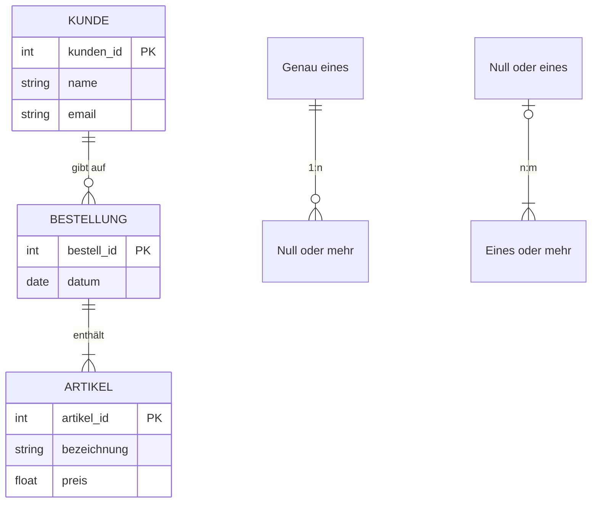
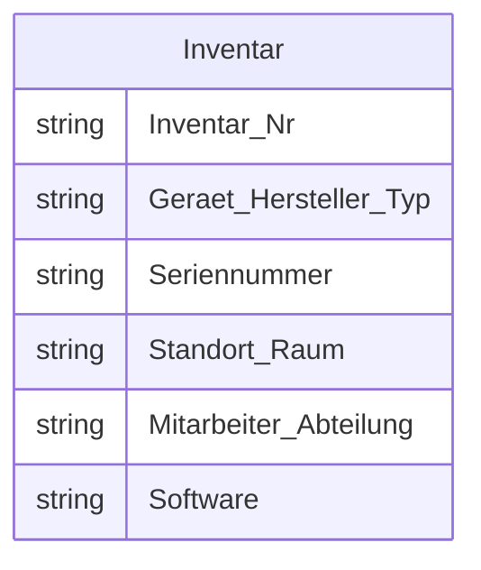
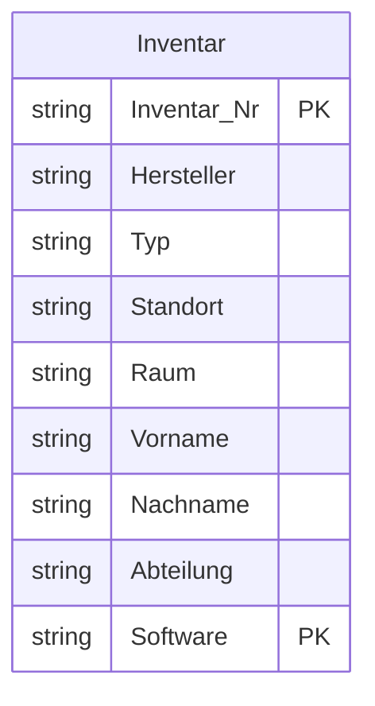
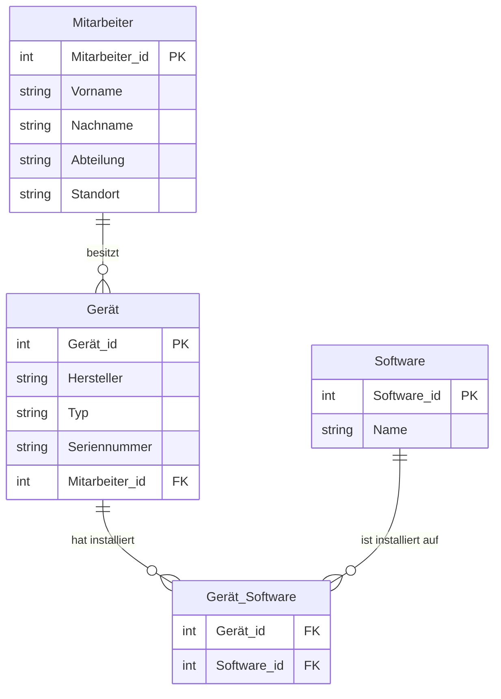
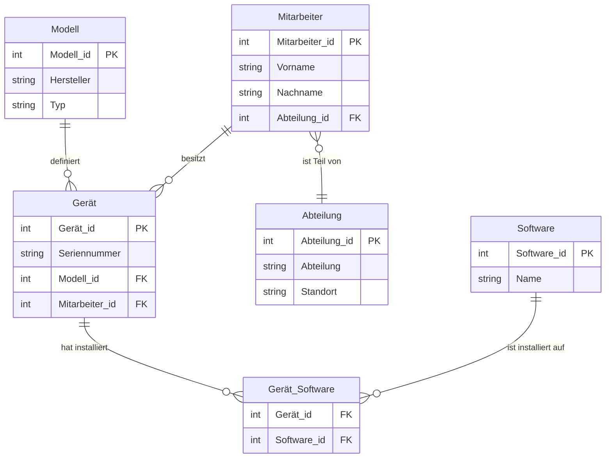

# Zahlensysteme

## Binär
Anders als beim dezimalen Zahlensystem, wird beim binären Zahlensystem mit einer Basis von 2 gerechnet. Eine Binärstelle kann also zwei Zustände haben. Dadurch können durch einfache Schalter Zahlen gespeichert werden.

## Hexadezimal  
Das hexadezimale Zahlensystem verwendet für die Darstellung von Zahlen Basis 16 (Hexa). Das bedeutet, dass eine Stelle, anders als beim Dezimalsystem, 16 verschiedene Ziffern haben kann. Eine Hexadezimalstelle kann dadurch 4 Binärstellen darstellen, was sich für große Zahlen eignet. 

## Umrechnungstabelle
| Binär | Dezimal | Hexadezimal |
| ----- | ------- | ----------- |
| 0000  | 00      | 0           |
| 0001  | 01      | 1           |
| 0010  | 02      | 2           |
| 0011  | 03      | 3           |
| 0100  | 04      | 4           |
| 0101  | 05      | 5           |
| 0110  | 06      | 6           |
| 0111  | 07      | 7           |
| 1000  | 08      | 8           |
| 1001  | 09      | 9           |
| 1010  | 10      | A           |
| 1011  | 11      | B           |
| 1100  | 12      | C           |
| 1101  | 13      | D           |
| 1110  | 14      | E           |
| 1111  | 15      | F           |

# Struktogramme 
Mit Struktogrammen können Programmabläufe ohne Bindung an eine Programmiersprache visuell dargestellt werden. Sie sind nach DIN 66261 genormt. 

| Algorithmischer Grundbaustein | Struktogramm                      | Scratch-Programm                    |
| ----------------------------- | --------------------------------- | ----------------------------------- |
| Anweisung                     |           |           |
| Sequenz                       |             |             |
| Schleife mit Bedingung        |  |  |
| Schleife mit Zähler           |     |     |
| Endlosschleife                |      |      |
| Verzweigung mit Alternative   |             |             |
| Verzweigung ohne Alternative  |                  |                  |

# Datenbanken
Um Daten in der Informationstechnik speichern zu können werden diese in Datenbanken gepseichert. Aufgabe einer Datenbank ist es, große Datenmengen effizient, widerspruchsfrei und dauerhaft zu speichern und benötigte Daten in bedarfsgerechten Darstellungsformen bereitzustellen.

## ER Diagramme
Das Entity-Relationship-Modell (ERM) ist ein Standard für den konzeptionellen Datenbankentwurf. Damit können Objekte, also Entities, und deren Attribute sowie Beziehungen (Relationships) und Kardinalitäten zu anderen Objekten dargestellt werden.
Die Kardinalität beschreibt in dem Fall die Art der Beziehung. Die Schreibweisen sind hier 1:1, 1:n, n:m, usw. Beispieslweise kann ein Kunde n (also mehrere) Bestellungen aufgeben. Die Kardinalität ist hier 1:n.

### Notationsformen
ER-Diagramme können verschieden dargestellt werden. Am besten Eigent sich jedoch die IDEF1X-Notation, da hier die Objekte und deren Attribute tabellarisch dargestellt sind.

## Normalformen
Um eine Datenbank effizient und ohne Redundanzen (doppelte Datenhaltung) zu gestalten, 
nutzt man die Normalisierung.

Oft werden Daten in Tabellentools wie z.B. Excel gespeichert und müssen dann in Datenbanken übertragen werden. Eine solche Tabelle könnte so aussehen:

### 1. Normalform
Eine Tabelle befindet sich in der 1. NF, wenn alle Attribute atomar sind. Das bedeutet, in jedem Feld darf nur ein einziger Wert stehen (z. B. "Vorname" und "Nachname" getrennt statt in einer Zelle) und es dürfen keine Wiederholungsgruppen existieren.

Um die oben gezeigte Tabelle der 1. NF anzupassen sind folgende Änderungen benötigt:
- `Geraet_Hersteller_Typ` wird in `Hersteller` und `Typ` getrennt
- `Standort_Raum` wird in `Standort` und `Raum` augeteilt
- `Mitarbeiter_Abteilung` wird aufgeteilt in `Vorname`, `Nachname` und `Abteilung`
- Da in `Software` beliebig viele Einträge vorhanden sein können, muss hier pro Software eine eigene Zeile pro Gerät erstellt werden.

Der Primärschlüssel setzt sich aus `Inventar_Nr` und `Software` zusammen.

### 2. Normalform
Voraussetzung ist die 1. NF. Zusätzlich muss jedes Nicht-Primärattribut von jedem Primärschlüssel voll funktional abhängig sein. Dies ist besonders bei zusammengesetzten Primärschlüsseln relevant: Daten, die nur von einem Teil des Schlüssels abhängen, müssen in eine eigene Tabelle ausgelagert werden.

Benötigte Anpassungen des Beispiels:
- Daten von Mitarbeitern und Software sind unabhängig von der Inventarnummer. Also müssen die Daten in getrennte Tabellen ausgelagert werden.
- Für die Software muss eine Verbindungstabelle erstellt werden, da Software unabhängig vom Gerät existiert

### 3. Normalform 
Voraussetzung ist die 2. NF. Darüber hinaus dürfen keine transitiven Abhängigkeiten bestehen. Das heißt, ein Nicht-Schlüsselattribut darf nicht von einem anderen Nicht-Schlüsselattribut abhängen (z. B. darf der "Wohnort" nicht von der "PLZ" abhängen, wenn beide keine Primärschlüssel sind; die PLZ-Wohnort-Beziehung gehört in eine separate Tabelle).

Benötigte Änderungen:
- `Hersteller` und `Typ` eines Geräts sind unabhängig von `Gerät_id`  
    -> neue Tabelle `Modell` (Hersteler könnte auch eigene Tabelle sein)
- `Abteilung` und `Standort` müssen in eigene Tabelle (Kann auch getrennt werden wenn nicht zusammenhängend)

## MySQL
### Subselect
# ER Diagramme
# C++
## Operatoren
## Schleifen
## Arrays
## Funktionen
## Strukturen
## Klassen
# HTML
# XML
# JSON

