# Zahlensysteme

## Binär

## Hexadezimal  
Das Hexadezimale Zahlensystem verwendet für die Darstellung von Zahlen Basis 16 (Hexa). Das bedeutet, dass eine Stelle, anders als beim Dezimalsystem, 16 verschiedene Ziffern haben kann. Eine Hexadezimalstelle kann dadurch 4 Binärstellen darstellen, was sich für große Zahlen eignet. 

## Umrechnungstabelle
|Binär|Dezimal|Hexadezimal|
|-----|-------|-----------|
|0000|00|0|
|0001|01|1|
|0010|02|2|
|0011|03|3|
|0100|04|4|
|0101|05|5|
|0110|06|6|
|0111|07|7|
|1000|08|8|
|1001|09|9|
|1010|10|A|
|1011|11|B|
|1100|12|C|
|1101|13|D|
|1110|14|E|
|1111|15|F|

# Struktogramme 
Mit Struktogrammen können Programmabläufe ohne Bindung an eine Programmiersprache visuell dargestellt werden. Sie sind nach DIN 66261 genormt. 

| Algorithmischer Grundbaustein | Struktogramm                      | Scratch-Programm                    |
| ----------------------------- | --------------------------------- | ----------------------------------- |
| Anweisung                     | 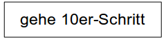          |           |
| Sequenz                       | 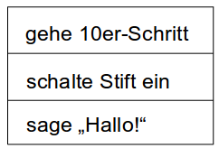            | 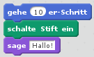            |
| Schleife mit Bedingung        | 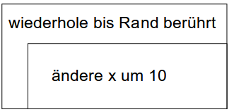 | 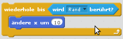 |
| Schleife mit Zähler           | 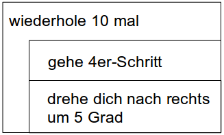    | 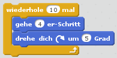    |
| Endlosschleife                | 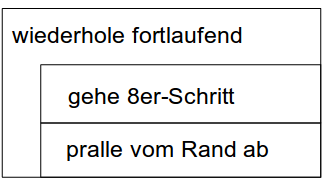     | 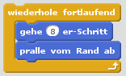     |
| Verzweigung mit Alternative   | 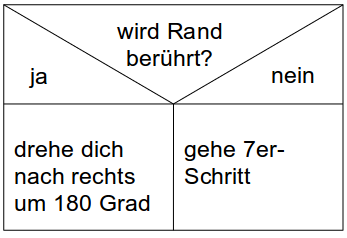            | 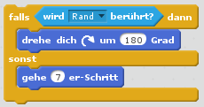            |
| Verzweigung ohne Alternative  | 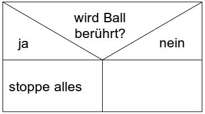                 | 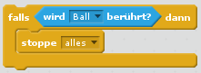                 |

 

 

 

 